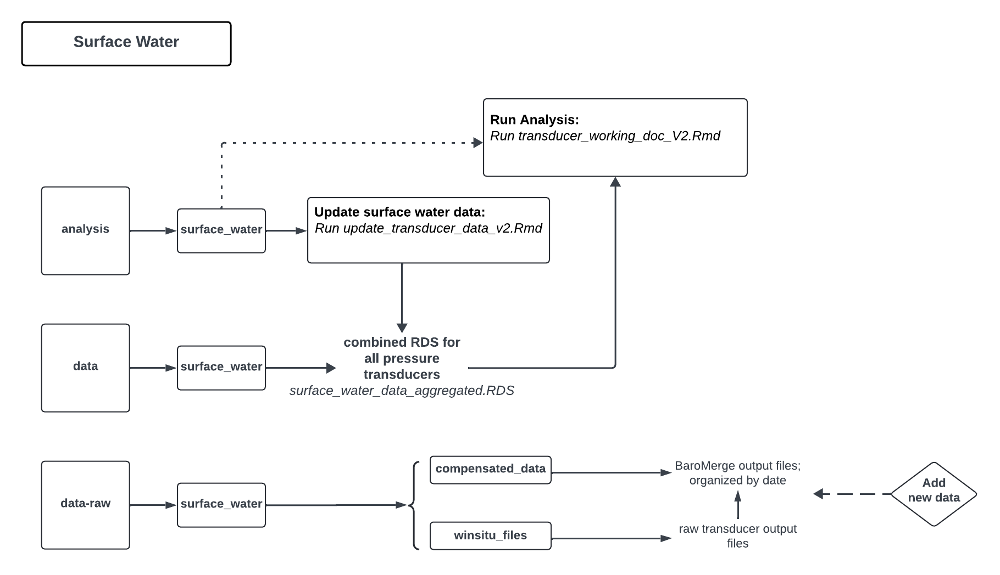

# Big Valley Water Resources Monitoring

## Surface Water

### Adding New Data 

Add new transducer data to `data-raw/surface_water/compensated_data` in a new folder

### Updating Aggregated Surface Water Data File 

To update the aggregated surface water file `data/surface_water/surface_water_data_aggregated.RDS` run the `analysis/surface_water/update_transducer_data_v2.Rmd` file

### Analyzing the surface water data  

The `analysis/surface_water/transducer_working_doc_v2.Rmd` will pull the aggregated surface water data and run the analysis performed by Cameron Tenner to QC the data and build figures

All figures will be located here: `data/surface_water/figures`

## Groundwater

### Adding New Data 

Add new groundwater data to `data-raw/groundwater` in a new folder 

### Updating Groundwater Data

To update the aggregated groundwater data `data/groundwater/groundwater_merged.rds` run the `analysis/groundwater/update_groundwater_data.Rmd` file. This file sources the `run_groundwater_files.R` which loops through all files within the the `data-raw/groundwater` folder.

### Analyzing the groundwater data 

TODO
