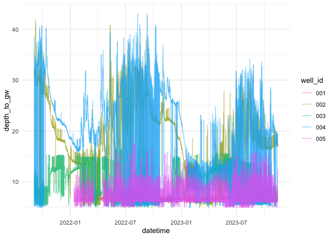

Update Groundwater Data
================
Maddee Wiggins and Cameron Tenner
2024-11-12

Source all the groundwater files in `data-raw/groundwater`

``` r
source(here::here('analysis', 'groundwater', 'run_groundwater_files.R'))
```

Visualize to check data is complete. Wells 02, 03, and 04 should have a
record from 09/03/2021 to present. Well 01 should have a record from
02/02/2022 to present. Well 05 should have a record from 01/12/2022 to
present.

``` r
groundwater_updated |> 
  group_by(well_id) |> 
  summarise(min_date = min(datetime),
            max_date = max(datetime)) |> 
  knitr::kable()
```

| well_id | min_date            | max_date            |
|:--------|:--------------------|:--------------------|
| 001     | 2022-02-02 13:29:00 | 2023-11-13 13:01:00 |
| 002     | 2021-09-03 14:22:26 | 2023-11-13 13:18:00 |
| 003     | 2021-09-03 15:43:23 | 2023-11-13 13:44:01 |
| 004     | 2021-09-03 17:10:32 | 2023-11-14 13:30:01 |
| 005     | 2022-01-12 17:22:29 | 2023-11-13 13:56:01 |

``` r
ggplot(groundwater_updated, aes(x = datetime, y = depth_to_gw, color = well_id)) + 
  geom_line(alpha = 0.5) +
  theme_minimal()
```

<!-- -->

Save output to `data/groundwater`

``` r
groundwater_updated |> write_rds(here::here("data", "groundwater", "groundwater_merged.rds"))
```
