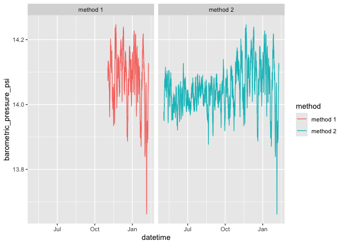
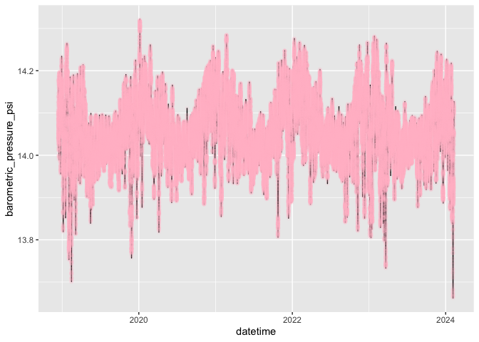
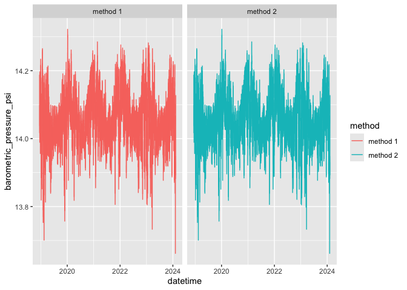
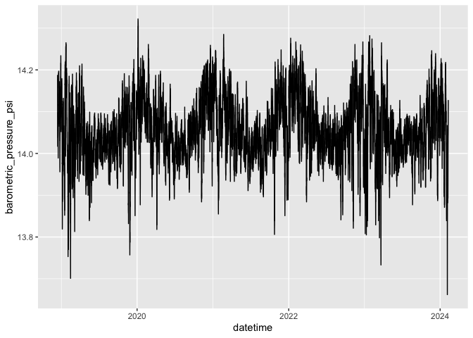

method comparison
================
Maddee Rubenson (FlowWest)
2024-10-23

Compare two methods for data ingestion:

**Method 1**: Pull in legacy data from `data/surface_water` and append
the new dataset to that

**Method 2**: Run all data within the
`data-raw/surface_water/compensated_data` which includes new datasets

## Method 1

Read in data through `qc_data.R`

Combine the newly updated files:

``` r
all_updated <- bind_rows(argonaut_updated, bellhill_updated, sodabay_updated, adobe_updated, highland_updated) |> 
  mutate(method = "method 1") |> 
  glimpse()
```

    ## Rows: 579,187
    ## Columns: 8
    ## $ seconds                 <dbl> 0, 900, 1800, 2700, 3600, 4500, 5400, 6300, 72…
    ## $ pressure_psi            <dbl> 0.289, 0.291, 0.292, 0.291, 0.286, 0.291, 0.28…
    ## $ depth_ft                <dbl> 0.668, 0.671, 0.674, 0.671, 0.661, 0.672, 0.65…
    ## $ barometric_pressure_psi <dbl> 14.110, 14.110, 14.108, 14.108, 14.105, 14.104…
    ## $ datetime                <dttm> 2022-02-01 10:00:00, 2022-02-01 10:15:00, 202…
    ## $ name                    <chr> "Argonaut Rd", "Argonaut Rd", "Argonaut Rd", "…
    ## $ temperature_f           <dbl> 45.5468, 45.5468, 45.5468, 45.4532, 45.4532, 4…
    ## $ method                  <chr> "method 1", "method 1", "method 1", "method 1"…

## Method 2

Read in the data through `run_all_files.R`

``` r
all_files_clean_method_2 <- all_files_clean |> 
  mutate(method = "method 2") |> 
  mutate(name = case_when(name == "Argonaut" ~ "Argonaut Rd",
                          name == "Adobe" ~ "Adobe Reservoir",
                          name == "Bell Hill" ~ "Bell Hill Rd",
                          name == "Highland" ~ "Highland Springs Reservoir",
                          name == "Soda Bay" ~ "Soda Bay Rd",
                          .default = as.character(name))) |> 
  glimpse()
```

    ## Rows: 596,663
    ## Columns: 9
    ## $ seconds                 <dbl> 0, 900, 1800, 2700, 3600, 4500, 5400, 6300, 72…
    ## $ pressure_psi            <dbl> -0.031, -0.035, -0.026, -0.031, -0.039, -0.028…
    ## $ temperature_f           <dbl> 89.568, 91.615, 94.247, 96.442, 98.292, 99.046…
    ## $ depth_ft                <dbl> -0.072, -0.082, -0.060, -0.073, -0.091, -0.065…
    ## $ barometric_pressure_psi <dbl> 14.114, 14.114, 14.108, 14.108, 14.112, 14.099…
    ## $ name                    <chr> "Adobe Reservoir", "Adobe Reservoir", "Adobe R…
    ## $ file_name               <chr> "Adobe Reservoir Outlet_2024-02-09_12-16-10-61…
    ## $ datetime                <dttm> 2023-11-01 13:00:00, 2023-11-01 13:15:00, 202…
    ## $ method                  <chr> "method 2", "method 2", "method 2", "method 2"…

## Method Comparison

**Take-a-ways**

- The minimum and maximum dates are the same for all records except
  Adobe Reservoir

- The number of records between the two methods is inconsistent for all
  transducers

``` r
all_files <- all_files_clean_method_2 |> 
   bind_rows(all_updated) |> 
   mutate(temperature_f = signif(temperature_f, 15))

all_files |>  
  group_by(method, name) |>
  summarise(min_date = min(datetime),
            max_date = max(datetime),
            n = n()) |> 
  arrange(name) |> 
  knitr::kable()
```

    ## `summarise()` has grouped output by 'method'. You can override using the
    ## `.groups` argument.

| method   | name                       | min_date            | max_date            |      n |
|:---------|:---------------------------|:--------------------|:--------------------|-------:|
| method 1 | Adobe Reservoir            | 2023-11-01 20:00:00 | 2024-02-09 17:30:00 |   9587 |
| method 2 | Adobe Reservoir            | 2023-05-03 12:00:00 | 2024-02-09 09:30:00 |  27063 |
| method 1 | Argonaut Rd                | 2018-12-13 17:00:00 | 2024-02-09 17:30:00 | 180847 |
| method 2 | Argonaut Rd                | 2018-12-13 09:00:00 | 2024-02-09 09:30:00 | 180847 |
| method 1 | Bell Hill Rd               | 2018-12-13 17:00:00 | 2024-02-09 17:30:00 | 180843 |
| method 2 | Bell Hill Rd               | 2018-12-13 09:00:00 | 2024-02-09 09:30:00 | 180843 |
| method 1 | Highland Springs Reservoir | 2023-05-03 19:00:00 | 2024-02-09 17:30:00 |  27063 |
| method 2 | Highland Springs Reservoir | 2023-05-03 12:00:00 | 2024-02-09 09:30:00 |  27063 |
| method 1 | Soda Bay Rd                | 2018-12-13 17:00:00 | 2024-02-09 17:30:00 | 180847 |
| method 2 | Soda Bay Rd                | 2018-12-13 09:00:00 | 2024-02-09 09:30:00 | 180847 |

### Adobe Reservoir

- The first method is truncating the dataset (see table above)
- All data that overlaps is the same

``` r
all_files |> 
  filter(name == "Adobe Reservoir") |> 
  ggplot(aes(x = datetime, y = barometric_pressure_psi)) + 
  geom_line(aes(color = method)) +
  facet_wrap(~method)
```

<!-- -->

### Argonaut Rd

- There are `8536` more rows in Method 2 vs. Method 1
- Looking at the rows that do not match, their are inconsistencies with
  the `seconds` column
- Missing data that is included in Method 2 between 2020-02-01 and
  2020-05-03
- The start and end dates are the same between the two methods

``` r
all_files |> 
  filter(name == "Argonaut Rd") |> 
  ggplot(aes(x = datetime, y = barometric_pressure_psi)) + 
  geom_line(aes(color = method)) + facet_wrap(~method)
```

<!-- -->

``` r
method1_arg <- all_files |> 
  filter(name == "Argonaut Rd" & method == "method 1") 

method2_arg <- all_files |> 
  filter(name == "Argonaut Rd" & method == "method 2") 

# all rows that are in method 2 but NOT in method 1
do_not_match <- method2_arg |> 
  select(-method, -file_name, -seconds) |> 
  anti_join(method1_arg |> 
              select(-method, -seconds)) 
```

    ## Joining with `by = join_by(pressure_psi, temperature_f, depth_ft,
    ## barometric_pressure_psi, name, datetime)`

``` r
do_not_match |>  
ggplot(aes(x = datetime, y = barometric_pressure_psi)) +
  geom_line()
```

<!-- -->

``` r
do_not_match |> 
  summarise(min_date = min(datetime),
            max_date = max(datetime))
```

    ## # A tibble: 1 × 2
    ##   min_date            max_date           
    ##   <dttm>              <dttm>             
    ## 1 2018-12-13 09:00:00 2024-02-09 09:30:00

``` r
all_files |> 
  filter(name == "Argonaut Rd" & method == "method 1") |> 
  ggplot(aes(x = datetime, y = barometric_pressure_psi)) + 
  geom_line() + 
  geom_point(data = do_not_match, aes(x = datetime, y = barometric_pressure_psi), color = 'pink', alpha = 0.1) 
```

<!-- -->

### Bell Hill Rd

- all the differences are within the year 2020

``` r
all_files |> 
  filter(name == "Bell Hill Rd") |> 
  ggplot(aes(x = datetime, y = barometric_pressure_psi)) + 
  geom_line(aes(color = method)) + facet_wrap(~method)
```

<!-- -->

``` r
method1_bell <- all_files |> 
  filter(name == "Bell Hill Rd" & method == "method 1") 

method2_bell <- all_files |> 
  filter(name == "Bell Hill Rd" & method == "method 2")# |> 
  #filter(datetime == "2020-01-01 19:00:15")

# all rows that are in method 2 but NOT in method 1
do_not_match <- method2_bell |> 
  select(-method, -file_name, -seconds) |> 
  anti_join(method1_bell |> 
              select(-method, -seconds)) 
```

    ## Joining with `by = join_by(pressure_psi, temperature_f, depth_ft,
    ## barometric_pressure_psi, name, datetime)`

``` r
# bell_1 <- method1_bell |> filter(datetime == "2023-11-01 13:00:00")
# bell_2 <- method2_bell |> filter(datetime == "2023-11-01 13:00:00")
# 
# bell_1
# bell_2

do_not_match |>  
ggplot(aes(x = datetime, y = barometric_pressure_psi)) +
  geom_line()
```

<!-- -->

``` r
do_not_match |> 
  summarise(min_date = min(datetime),
            max_date = max(datetime))
```

    ## # A tibble: 1 × 2
    ##   min_date            max_date           
    ##   <dttm>              <dttm>             
    ## 1 2018-12-13 09:00:00 2024-02-09 09:30:00

``` r
all_files |> 
  filter(name == "Bell Hill Rd" & method == "method 1") |> 
  ggplot(aes(x = datetime, y = barometric_pressure_psi)) + 
  geom_line() + 
  geom_point(data = do_not_match, aes(x = datetime, y = barometric_pressure_psi), color = 'pink', alpha = 0.1) 
```

<!-- -->

Explore differences between the two methods
