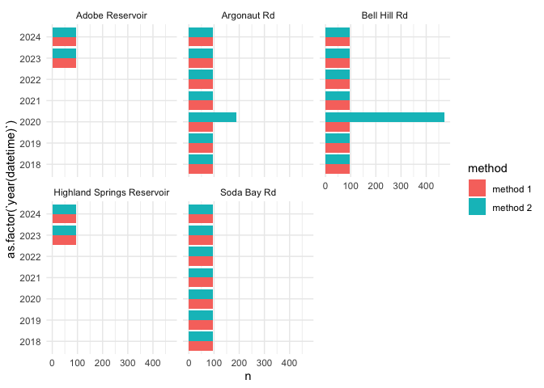
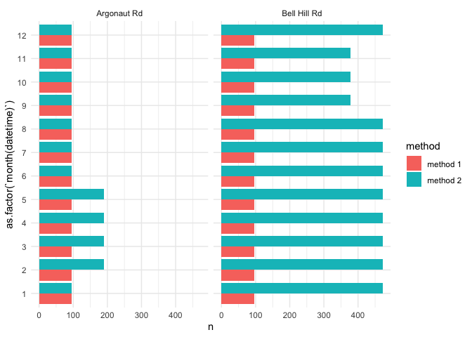
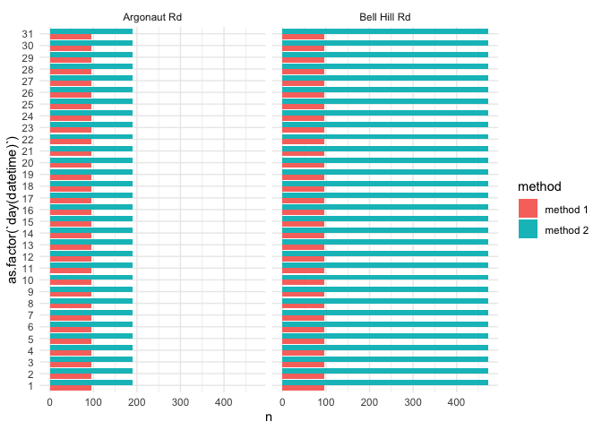
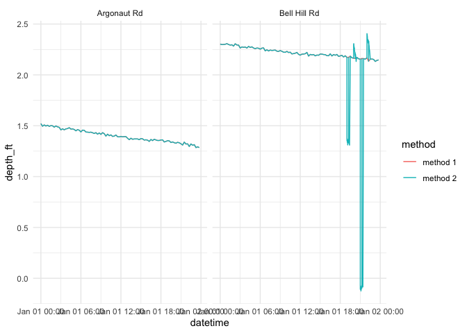
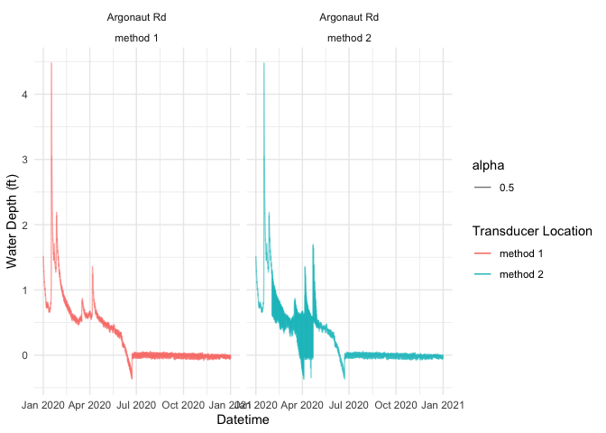
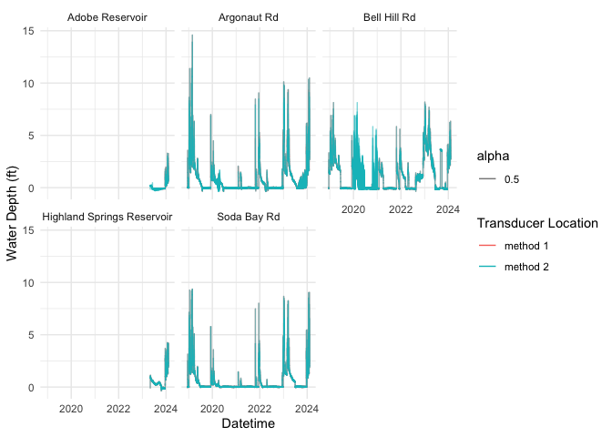
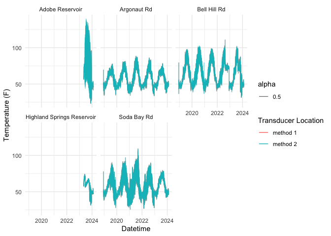
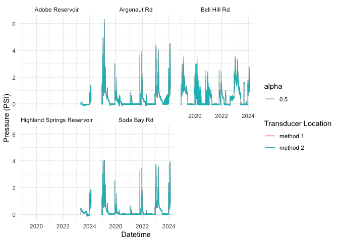

method comparison
================
Maddee Rubenson (FlowWest)
2024-08-22

Compare two methods for data ingestion:

**Method 1**: Pull in legacy data from `data/surface_water` and append
the new dataset to that

**Method 2**: Run all data within the
`data-raw/surface_water/compensated_data` which includes new datasets

## Method 1

Read in data through `qc_data.R`

Combine the newly updated files:

``` r
all_updated <- bind_rows(argonaut_updated, bellhill_updated, sodabay_updated, adobe_updated, highland_updated) |> 
  mutate(method = "method 1") |> 
  glimpse()
```

    ## Rows: 579,187
    ## Columns: 8
    ## $ seconds                 <dbl> 0, 900, 1800, 2700, 3600, 4500, 5400, 6300, 72…
    ## $ pressure_psi            <dbl> 0.289, 0.291, 0.292, 0.291, 0.286, 0.291, 0.28…
    ## $ depth_ft                <dbl> 0.668, 0.671, 0.674, 0.671, 0.661, 0.672, 0.65…
    ## $ barometric_pressure_psi <dbl> 14.110, 14.110, 14.108, 14.108, 14.105, 14.104…
    ## $ datetime                <dttm> 2022-02-01 10:00:00, 2022-02-01 10:15:00, 202…
    ## $ name                    <chr> "Argonaut Rd", "Argonaut Rd", "Argonaut Rd", "…
    ## $ temperature_f           <dbl> 45.5468, 45.5468, 45.5468, 45.4532, 45.4532, 4…
    ## $ method                  <chr> "method 1", "method 1", "method 1", "method 1"…

## Method 2

Read in the data through `run_all_files.R`

``` r
all_files_clean_method_2 <- all_files_clean |> 
  mutate(method = "method 2") |> 
  mutate(name = case_when(name == "Argonaut" ~ "Argonaut Rd",
                          name == "Adobe" ~ "Adobe Reservoir",
                          name == "Bell Hill" ~ "Bell Hill Rd",
                          name == "Highland" ~ "Highland Springs Reservoir",
                          name == "Soda Bay" ~ "Soda Bay Rd",
                          .default = as.character(name))) |> 
  glimpse()
```

    ## Rows: 730,108
    ## Columns: 9
    ## $ seconds                 <dbl> 0, 900, 1800, 2700, 3600, 4500, 5400, 6300, 72…
    ## $ pressure_psi            <dbl> -0.031, -0.035, -0.026, -0.031, -0.039, -0.028…
    ## $ temperature_f           <dbl> 89.568, 91.615, 94.247, 96.442, 98.292, 99.046…
    ## $ depth_ft                <dbl> -0.072, -0.082, -0.060, -0.073, -0.091, -0.065…
    ## $ barometric_pressure_psi <dbl> 14.114, 14.114, 14.108, 14.108, 14.112, 14.099…
    ## $ name                    <chr> "Adobe Reservoir", "Adobe Reservoir", "Adobe R…
    ## $ file_name               <chr> "Adobe Reservoir Outlet_2024-02-09_12-16-10-61…
    ## $ datetime                <dttm> 2023-11-01 13:00:00, 2023-11-01 13:15:00, 202…
    ## $ method                  <chr> "method 2", "method 2", "method 2", "method 2"…

## Method Comparison

**Take-a-ways**

- The minimum and maximum dates are the same for all records except
  Adobe Reservoir

- The number of records between the two methods is inconsistent for all
  transducers

``` r
all_files <- all_files_clean_method_2 |> 
   bind_rows(all_updated) 

all_files |>  
  group_by(method, name) |>
  summarise(min_date = min(datetime),
            max_date = max(datetime),
            n = n()) |> 
  arrange(name) |> 
  knitr::kable()
```

    ## `summarise()` has grouped output by 'method'. You can override using the
    ## `.groups` argument.

| method   | name                       | min_date            | max_date            |      n |
|:---------|:---------------------------|:--------------------|:--------------------|-------:|
| method 1 | Adobe Reservoir            | 2023-11-01 13:00:00 | 2024-02-09 09:30:00 |   9587 |
| method 2 | Adobe Reservoir            | 2023-05-03 12:00:00 | 2024-02-09 09:30:00 |  27063 |
| method 1 | Argonaut Rd                | 2018-12-13 09:00:00 | 2024-02-09 09:30:00 | 180847 |
| method 2 | Argonaut Rd                | 2018-12-13 09:00:00 | 2024-02-09 09:30:00 | 189383 |
| method 1 | Bell Hill Rd               | 2018-12-13 09:00:00 | 2024-02-09 09:30:00 | 180843 |
| method 2 | Bell Hill Rd               | 2018-12-13 09:00:00 | 2024-02-09 09:30:00 | 305752 |
| method 1 | Highland Springs Reservoir | 2023-05-03 12:00:00 | 2024-02-09 09:30:00 |  27063 |
| method 2 | Highland Springs Reservoir | 2023-05-03 12:00:00 | 2024-02-09 09:30:00 |  27063 |
| method 1 | Soda Bay Rd                | 2018-12-13 09:00:00 | 2024-02-09 09:30:00 | 180847 |
| method 2 | Soda Bay Rd                | 2018-12-13 09:00:00 | 2024-02-09 09:30:00 | 180847 |

Explore differences between the two methods

``` r
all_files |> 
  group_by(year(datetime), month(datetime), day(datetime), method, name) |> 
  summarise(n = n()) |> 
  ggplot() + 
  geom_col(aes(x = as.factor(`year(datetime)`), y = n, fill = method), position = "dodge") + 
  facet_wrap(~ name) +
  coord_flip() +
  theme_minimal()
```

    ## `summarise()` has grouped output by 'year(datetime)', 'month(datetime)',
    ## 'day(datetime)', 'method'. You can override using the `.groups` argument.

<!-- -->

``` r
all_files |> 
  filter(year(datetime) == 2020) |> 
  filter(name %in% c("Argonaut Rd", "Bell Hill Rd")) |> 
  group_by(year(datetime), month(datetime), day(datetime), method, name) |> 
  summarise(n = n()) |> 
  ggplot() + 
  geom_col(aes(x = as.factor(`month(datetime)`), y = n, fill = method), position = "dodge") + 
  facet_wrap(~ name) +
  coord_flip() +
  theme_minimal()
```

    ## `summarise()` has grouped output by 'year(datetime)', 'month(datetime)',
    ## 'day(datetime)', 'method'. You can override using the `.groups` argument.

<!-- -->

``` r
all_files |> 
  filter(year(datetime) == 2020) |> 
  filter(name %in% c("Argonaut Rd", "Bell Hill Rd")) |> 
  group_by(year(datetime), month(datetime), day(datetime), method, name) |> 
  summarise(n = n()) |> 
  ggplot() + 
  geom_col(aes(x = as.factor(`day(datetime)`), y = n, fill = method), position = "dodge") + 
  facet_wrap(~ name) +
  coord_flip() +
  theme_minimal()
```

    ## `summarise()` has grouped output by 'year(datetime)', 'month(datetime)',
    ## 'day(datetime)', 'method'. You can override using the `.groups` argument.

<!-- -->

``` r
all_files |> 
  filter(year(datetime) == 2020 & day(datetime) == 1 & month(datetime) == 1) |> 
  filter(name %in% c("Argonaut Rd")) |> 
  arrange(datetime) 
```

    ## # A tibble: 192 × 9
    ##      seconds pressure_psi temperature_f depth_ft barometric_pressure_psi name   
    ##        <dbl>        <dbl>         <dbl>    <dbl>                   <dbl> <chr>  
    ##  1 33145200.        0.659          46.4     1.52                    14.1 Argona…
    ##  2 33145200.        0.659          46.4     1.52                    14.1 Argona…
    ##  3 33146100.        0.647          46.3     1.50                    14.1 Argona…
    ##  4 33146100.        0.647          46.3     1.50                    14.1 Argona…
    ##  5 33147000.        0.653          46.3     1.51                    14.1 Argona…
    ##  6 33147000.        0.653          46.3     1.51                    14.1 Argona…
    ##  7 33147900.        0.648          46.4     1.50                    14.1 Argona…
    ##  8 33147900.        0.648          46.4     1.50                    14.1 Argona…
    ##  9 33148800.        0.652          46.3     1.50                    14.1 Argona…
    ## 10 33148800.        0.652          46.3     1.50                    14.1 Argona…
    ## # ℹ 182 more rows
    ## # ℹ 3 more variables: file_name <chr>, datetime <dttm>, method <chr>

``` r
# Method 2 has data betwen 2020-01-01 23:00:15 and 2020-01-01 23:15:00 AND and 2020-01-01 23:15:15 to 2020-01-01 23:30:00
# that does not exist in Method 1 

all_files |> 
  filter(year(datetime) == 2020 & day(datetime) == 1 & month(datetime) == 1) |> 
  filter(name %in% c("Argonaut Rd", "Bell Hill Rd")) |> 
  ggplot() + 
  geom_line(aes(x = datetime, y = depth_ft, color = method)) +
  facet_wrap(~name) +
  theme_minimal()
```

<!-- -->

``` r
all_files |>
  filter(name == "Argonaut Rd") |>
  filter(year(datetime) == 2020) |> 
  ggplot(aes(x = datetime, y = depth_ft, color = method, alpha = 0.5)) +
  geom_line() +
  labs(color = "Transducer Location", x = "Datetime", y = "Water Depth (ft)") +
  theme_minimal() +
  facet_wrap(~name + method)
```

<!-- -->

``` r
all_files |>
  # filter(name == "Argonaut Rd") |>
  # filter(year(datetime) == 2020) |> 
  ggplot(aes(x = datetime, y = depth_ft, color = method, alpha = 0.5)) +
  geom_line() +
  labs(color = "Transducer Location", x = "Datetime", y = "Water Depth (ft)") +
  theme_minimal() +
  facet_wrap(~name)
```

<!-- -->

``` r
all_files |> 
  ggplot(aes(x = datetime, y = temperature_f, color = method,alpha = 0.5)) +     
  geom_line() + 
  labs(color = "Transducer Location", x = "Datetime", y = "Temperature (F)") +
  theme_minimal() + 
  facet_wrap(~name)
```

<!-- -->

``` r
all_files |>
  ggplot(aes(x = datetime, y = pressure_psi, color = method, alpha = 0.5)) +
  geom_line() +
  labs(color = "Transducer Location", x = "Datetime", y = "Pressure (PSI)") +
  theme_minimal() +
  facet_wrap(~name)
```

<!-- -->
