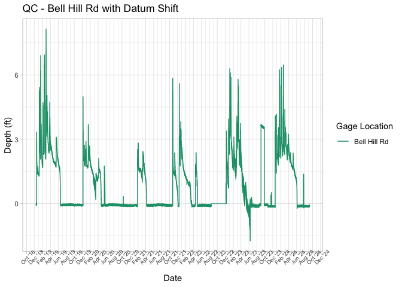
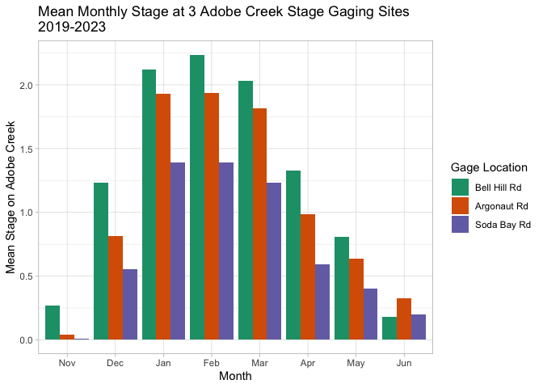

Surface Water Data QC
================
Maddee Wiggins
2024-12-06

- [Surface Water Data QC](#surface-water-data-qc)
  - [Load in BVR data](#load-in-bvr-data)
  - [Load in 3rd Party data](#load-in-3rd-party-data)
  - [Raw Data](#raw-data)
  - [NEW DATA QC](#new-data-qc)
  - [Previous QC](#previous-qc)
  - [Data Exploration](#data-exploration)
  - [Data Quality Figures](#data-quality-figures)
  - [Reservoir Figures](#reservoir-figures)

# Surface Water Data QC

The purpose of this document is to QC the surface water data which is
periodically collected by Big Valley Rancheria using Rugged Troll 200.
The data have been corrected using barometric pressure.

### Load in BVR data

``` r
surface_water <- readRDS(here::here('data', 'surface_water', 'surface_water_data_aggregated.RDS'))

# unsure if this is for GW or SW
stage_flow <- readxl::read_xlsx(here::here('data-raw', 'surface_water', 'Flow_vs_Depth_Table.xlsx'), sheet = "Data") 
```

### Load in 3rd Party data

``` r
clearlake_level <- readNWISdv("11450000", "00065","2007-10-01", Sys.Date()) |> 
  mutate(WSE = X_00065_00003 + 1318.26,
         Date = as.POSIXct(Date, tz = "America/Los_Angeles"))

SW_bellhill_WB <- readxl::read_xlsx(here::here('data-raw', 'surface_water', 'water_board', 'PressureTransducer_and_Flow_Data_20230728.xlsx'), 
                                    sheet = "AC4-2023 Data", skip = 8)  |>
  mutate(Date = as.POSIXct(`Date Time (UTC)`),
         Date = with_tz(Date, "America/Los_Angeles"))

SW_kelsey_kelseyville_USGS <- read_csv(here::here('data-raw', 'surface_water', 'kelsey_kelseyville_usgs_stage_20240201.csv'))  |>
  mutate(Datetime = as.POSIXct(Datetime, format = "%m/%d/%Y %H:%M", tz = "America/Los_Angeles"),
         WSE = Stage + 1475.44)
```

**Timeframe:**

Surface Water Data: 2018-12-13 09:00:00 - 2024-09-06 11:45:00

**Completeness of record throughout timeframe:** Complete

**Sampling Location**:

Surface Water Data: Pressure transducers are located in the creek bed at
Bell Hill Rd, Argonaut Rd, Soda Bay Rd, Adobe Reservoir, and Highland
Springs Reservoir.

### Raw Data

``` r
surface_water |> 
  group_by(name) |>
  summarise(min_date = min(datetime),
            max_date = max(datetime),
            n_records = n()) |> 
  knitr::kable()
```

| name                       | min_date            | max_date            | n_records |
|:---------------------------|:--------------------|:--------------------|----------:|
| Adobe Reservoir            | 2023-05-03 12:00:00 | 2024-09-06 11:45:00 |     47228 |
| Argonaut Rd                | 2018-12-13 09:00:00 | 2024-09-06 11:45:00 |    201012 |
| Bell Hill Rd               | 2018-12-13 09:00:00 | 2024-09-06 11:45:00 |    201008 |
| Highland Springs Reservoir | 2023-05-03 12:00:00 | 2024-09-06 11:45:00 |     47228 |
| Soda Bay Rd                | 2018-12-13 09:00:00 | 2024-09-06 11:45:00 |    201012 |

``` r
ggplot(data = surface_water, aes(x = datetime, y = depth_ft, color = name)) +     
  geom_line() + 
  scale_color_manual(values = palette) +
  labs(color = "Transducer Location", x = "Datetime", y = "Water Depth (ft)") +
  theme_minimal() +
  facet_wrap(~name, scales = "free_y")
```

<!-- -->

### NEW DATA QC

**Description of New Data** - new data was uploaded for `2024-09-06`

**Description of QC**

``` r
new_data <- c(
  'Adobe Reservoir Outlet_Append_2024-09-06_12-37-57-838-BaroMerge.csv',
  'Argonaut_Append_2024-09-06_13-25-29-804-BaroMerge.csv',
  'Bell Hill_Append_2024-09-06_12-58-21-777-BaroMerge.csv',
  'Highland Springs Outlet_Append_2024-09-06_13-09-48-628-BaroMerge.csv',
  'Soda Bay_Append_2024-09-06_11-46-00-928-BaroMerge.csv'
)

# Extract the iteration(s) corresponding to the new data
new_data_iterations <- surface_water |> 
  filter(file_name %in% new_data) |> 
  pull(iteration) |> 
  unique()

# Get the previous iteration(s)
previous_iterations <- new_data_iterations - 2

# Combine the new data with the corresponding previous data
new_data_and_previous_data <- surface_water |> 
  filter(iteration >= previous_iterations) 

# plot
ggplot(new_data_and_previous_data, aes(datetime, y = depth_ft)) +
  geom_line(aes(color = as.factor(iteration))) +
  theme_minimal() +
  facet_wrap(~name, ncol = 2) + 
  theme(strip.text = element_text(size = 10),
        legend.position = "bottom")
```

<!-- -->

##### Identify any datum shifts

``` r
# function
flag_datum_shift <- function(data, threshold = 1.0) {
  data |> 
    group_by(name) |> 
    arrange(datetime) |> 
    mutate(
      diff = c(NA, diff(depth_ft)),  
      flagged = ifelse(abs(diff) > threshold, TRUE, FALSE)  
    )
}

threshold <- 1  # Adjust threshold for your data
flagged_data <- flag_datum_shift(new_data_and_previous_data, threshold)

ggplot(flagged_data, aes(x = datetime, y = depth_ft)) +
  geom_line() +
  geom_point(data = flagged_data %>% filter(flagged), 
             aes(x = datetime, y = depth_ft), 
             color = "red", size = 3, shape = 8) +
  labs(x = "Time",
       y = "Depth (ft)",
       title = "Datum Shift Detection",
       subtitle = paste("Threshold for datum shift =", threshold, "ft")) +
  theme_minimal() +
  facet_wrap(~name)
```

<!-- -->

``` r
flagged_data |>  
  filter(flagged) |> 
  select(name, datetime, depth_ft, diff, file_name)
```

    ## # A tibble: 11 × 5
    ## # Groups:   name [4]
    ##    name                       datetime            depth_ft  diff file_name      
    ##    <chr>                      <dttm>                 <dbl> <dbl> <chr>          
    ##  1 Argonaut Rd                2022-12-27 07:45:00    2.68   2.63 Argonaut_Appen…
    ##  2 Argonaut Rd                2022-12-27 08:00:00    4.65   1.97 Argonaut_Appen…
    ##  3 Soda Bay Rd                2022-12-27 09:15:00    3.97   3.12 Soda Bay_Appen…
    ##  4 Highland Springs Reservoir 2023-05-03 12:30:00    0.989  1.12 Highland Sprin…
    ##  5 Bell Hill Rd               2023-09-01 08:15:00    3.66   3.70 Bell Hill_Appe…
    ##  6 Bell Hill Rd               2023-09-26 09:00:00   -0.062 -3.6  Bell Hill_Appe…
    ##  7 Bell Hill Rd               2023-12-19 01:15:00    2.39   1.58 Bell Hill_Appe…
    ##  8 Argonaut Rd                2023-12-19 09:45:00    2.60   2.22 Argonaut_Appen…
    ##  9 Soda Bay Rd                2023-12-19 12:00:00    1.56   1.55 Soda Bay_Appen…
    ## 10 Highland Springs Reservoir 2024-02-22 23:00:00    1.86  -1.03 Highland Sprin…
    ## 11 Highland Springs Reservoir 2024-03-06 07:30:00    1.87  -1.10 Highland Sprin…

##### Other QC issues

**fix issues here and describe**

##### Replace QC’d data in final dataset

``` r
surface_water <- surface_water |> 
  filter(!(file_name %in% new_data_and_previous_data$file_name)) |> 
  bind_rows(new_data_and_previous_data)
```

### Previous QC

| Step                  | Description                                                                                                                                                                                                                                                                                                                                              | Affected_Data |
|:----------------------|:---------------------------------------------------------------------------------------------------------------------------------------------------------------------------------------------------------------------------------------------------------------------------------------------------------------------------------------------------------|:--------------|
| Datum Shift           | Applied a 1.9 ft datum shift for Bell Hill Rd for December 2022                                                                                                                                                                                                                                                                                          | Bell Hill Rd  |
| Remove Invalid Ranges | Between 08/15/2022 and 12/07/2022 assign NA values to Bell Hill Rd. After 12/07/2022 and until depths drop to ~0 on 06/10/23, correct depths -1.9 ft. This depth is derived from transect taken on 1/24/2023                                                                                                                                             | Bell Hill Rd  |
| Remove data           | Remove data between 04/05/2023 and 06/10/2023 for Bell Hill Gage. Also going to remove the data from 09/01/2023 to 09/27/2023 when the transducer was removed.                                                                                                                                                                                           | Bell Hill Rd  |
| Oscillations          | Performed offset correction for dry oscillating conditions. Calculated average oscillation offsets for each transducer and applied vertical adjustments to center dry values around 0 ft of depth.                                                                                                                                                       | All locations |
| Oscillations          | Assign all values less than or equal to the maximum observed depth among these dry conditions oscillations for each transducer to zero                                                                                                                                                                                                                   | All locations |
| Replace values        | Something odd is happening at Argonaut starting in August of 2023, lasting until the first rains of WY 2024 in December 2023. Sudden, high oscillation recordings while other gages show 0 flow, and precipitation record shows no precipitation. Replace values between the pattern starting (08/15/2023) and first real flows of WY 2024 (12/19/2023). | Argonaut Rd   |

Summary of Adjustments Made to Surface Water Data

#### Datum Shift

``` r
surface_water <- surface_water |> 
  mutate(depth_adjust = 
           case_when(
             name == "Bell Hill Rd" & 
               datetime > as.POSIXct("2022-08-15 07:30:00", tz="America/Los_Angeles") & 
               datetime < as.POSIXct("2022-12-07 15:30:00", tz="America/Los_Angeles") ~ 
               0, #only way casewhen() will take NA value???
             name == "Bell Hill Rd" & 
               datetime > as.POSIXct("2022-12-07 7:45:00", tz="America/Los_Angeles") & 
               datetime < as.POSIXct("2023-06-10 15:00:00", tz="America/Los_Angeles") ~ 
               depth_ft - 1.9,
             T ~ depth_ft
           ))

ggplot(data = surface_water |> filter(name == "Bell Hill Rd"), aes(x = datetime, y = depth_adjust, color = name)) + 
  geom_line() + 
  theme_light() +
  scale_color_brewer(type = 'qual', palette = 'Dark2') +
  scale_x_datetime(date_labels = "%b '%y",
                   date_breaks = "2 months") +
  theme(axis.text.x = element_text(size = 7, angle = 45)) +
  labs(
    title = "QC - Bell Hill Rd with Datum Shift",
    y = "Depth (ft)",
    color = "Gage Location",
    x = "Date"
  ) 
```

<!-- -->

Compare to Water Board data

``` r
# From this we see that the datum shift makes our data match with Water Board's data at the same location for most of the winter. 
# However, they begin to diverge in early April of 2023. 
# 
# To account for this, going to remove data between 04/05/2023 and 06/10/2023 for Bell Hill Gage. 
# 
# Also going to remove the data from 09/01/2023 to 09/27/2023 when the transducer was removed. 

ggplot(data = surface_water |> filter(name == "Bell Hill Rd"), aes(x=datetime, y=depth_adjust, color = "BVR EPA")) + 
  geom_line() + 
  geom_line(data = SW_bellhill_WB, aes(x=Date, y = `Depth (ft)`, color = "Water Board")) + 
  scale_color_manual(name = "", values = c("BVR EPA" = "#1B9E77", "Water Board" = "red")) + 
  scale_y_continuous(limits = c(-1.75, 6.5), breaks = c(-1, 0, 1, 2, 3, 4, 5, 6)) +
  scale_x_datetime(date_labels = "%m/%d",
                   date_breaks = "2 weeks",
                   minor_breaks = "1 week",
                   limits = c(as.POSIXct("2023-02-15 00:00:00", tz="America/Los_Angeles"), as.POSIXct("2023-07-01 00:00:00", tz="America/Los_Angeles"))
  ) + 
  labs(x = "Date", y = "Depth (ft)", title = "Comparison of BVR EPA and Water Board Transducer \n  Measurements at Bell Hill Rd, 2023") +
  theme_minimal() +
  theme(axis.text.x = element_text(size = 10, angle = 0, vjust = 0),
        panel.grid.major = element_line(colour = "grey60", size = 0.25),
        panel.grid.minor = element_line(colour = "grey80", size = 0.2),
        text = element_text(size = 12),
        plot.title = element_text(hjust=0.5),
        axis.title = element_text(size = 13),
        legend.position = "bottom",
        legend.direction = "horizontal",
        legend.margin = margin(t = 0, r = 0, b = 0, l = 0, unit = "in"),
        legend.title = element_blank(),
        plot.margin = margin(t = 0.25, r = 0, b = 0.25, l = 0, unit = "in"))
```

<!-- -->

``` r
surface_water <- surface_water |> 
  mutate(depth_adjust02 = 
           case_when(
             name == "Bell Hill Rd" & 
               datetime > as.POSIXct("2023-04-05 08:00:00", tz="America/Los_Angeles") &
               datetime < as.POSIXct("2023-06-10 15:00:00", tz="America/Los_Angeles") ~
               NA_real_,
             name == "Bell Hill Rd" & 
               datetime >= as.POSIXct("2023-09-01 08:00:00", tz="America/Los_Angeles") &
               datetime < as.POSIXct("2023-09-27 09:00:00", tz="America/Los_Angeles") ~ 
               0,
             T ~ depth_adjust
           ))

ggplot(data = surface_water |> filter(name == "Bell Hill Rd"), aes(x = datetime, y = depth_adjust02, color = name)) + 
  geom_line() + 
  theme_light() +
  scale_color_brewer(type = 'qual', palette = 'Dark2') +
  scale_x_datetime(date_labels = "%b '%y",
                   date_breaks = "2 months") +
  theme(axis.text.x = element_text(size = 7, angle = 45)) +
  labs(
    title = "QC - adjustments from waterboard comparison",
    y = "Depth (ft)",
    color = "Gage Location",
    x = "Date"
  ) 
```

<!-- -->

#### Vertical Oscillations

This resolves issues with oscillations when the creeks are dry. Each
dataset is vertically transformed to get the zero flow values to roughly
evenly distribute around 0 feet depth. Assign all values less than or
equal to the maximum observed depth among these dry conditions
oscillations for each transducer to zero.

``` r
bellhill_offset <- mean((surface_water |> filter(name == "Bell Hill Rd"))$depth_adjust02[(surface_water |> filter(name == "Bell Hill Rd"))$depth_adjust02 <= 0.01], na.rm = T)

argonaut_offset <- mean((surface_water |> filter(name == "Argonaut Rd"))$depth_adjust02[(surface_water |> filter(name == "Argonaut Rd"))$depth_adjust02 <= 0.062], na.rm = T)

sodabay_offset <- mean((surface_water |> filter(name == "Soda Bay Rd"))$depth_adjust02[(surface_water |> filter(name == "Soda Bay Rd"))$depth_adjust02 <= 0.087], na.rm = T)

adoberes_offset <- mean((surface_water |> filter(name == "Adobe Reservoir"))$depth_adjust02[(surface_water |> filter(name == "Adobe Reservoir"))$depth_adjust02 <= 0.059], na.rm = T)

highlandspringsres_offset <- mean((surface_water |> filter(name == "Highland Springs Reservoir"))$depth_adjust02[(surface_water |> filter(name == "Highland Springs Reservoir"))$depth_adjust02 <= -0.086], na.rm = T)
```

``` r
surface_water <- surface_water |> 
  mutate(depth_adjust03 = case_when(
    # The following numbers are derived from the maximum "zero flow" values across whole record for each transducer
    name == "Bell Hill Rd" ~ depth_adjust02 - bellhill_offset,
    name == "Argonaut Rd" ~ depth_adjust02 - argonaut_offset,
    name == "Soda Bay Rd" ~ depth_adjust02 - sodabay_offset,
    # Following values are based on an offset that will make the lowest oscillations oscillate around zero.
    name == "Adobe Reservoir" ~ depth_adjust02 - adoberes_offset,
    name == "Highland Springs Reservoir" ~ depth_adjust02 - highlandspringsres_offset,
    T ~ depth_adjust02
  )) |> 
  mutate(
    depth_adjust03 = case_when(
      name == "Bell Hill Rd" & depth_adjust03 <= 0.0759 ~ 0,
      name == "Argonaut Rd" & depth_adjust03 < 0.0768 ~ 0,
      name == "Soda Bay Rd" & depth_adjust03 <= 0.0753 ~ 0,
      name == "Adobe Reservoir" & depth_adjust03 <= 0.063 ~ 0,
      name == "Highland Springs Reservoir" & depth_adjust03 <= 0.048 ~0,
      T ~ depth_adjust03
    )) 

 ggplot(data = surface_water, aes(x = datetime, y = depth_adjust03, color = name)) + 
  geom_line() + 
  theme_light() +
  scale_color_brewer(type = 'qual', palette = 'Dark2') +
  scale_x_datetime(date_labels = "%b '%y",
                   date_breaks = "2 months") +
  theme(axis.text.x = element_text(size = 7, angle = 45)) +
  labs(
    title = "QC - Vertical Oscillation Adjustments",
    y = "Depth (ft)",
    color = "Gage Location",
    x = "Date"
  ) 
```

<!-- -->

``` r
# Something odd is happening at Argonaut starting in August of 2023, lasting until the first rains of WY 2024 in December 2023. Sudden, high oscillation recordings while other gages show 0 flow, and precipitation record shows no precipitation. Let's replace values between the pattern starting (08/15/2023) and first real flows of WY 2024 (12/19/2023). 
# 
surface_water <- surface_water |> 
  mutate(depth_adjust04 = 
           case_when(
             name == "Argonaut Rd" & 
               datetime > as.POSIXct("2023-08-16 00:00:00", tz="America/Los_Angeles") &
               datetime < as.POSIXct("2023-12-19 09:15:00", tz="America/Los_Angeles") ~ 
               0,
             T ~ depth_adjust03
           ))

ggplot(data = surface_water |> filter(name == "Argonaut Rd"), aes(x=datetime, y=depth_adjust04, color=name)) + 
  geom_line() + 
  theme_light() +
  scale_color_brewer(type = 'qual', palette = 'Dark2') +
  scale_x_datetime(date_labels = "%b '%y",
                   date_breaks = "2 months") +
  theme(axis.text.x = element_text(size = 7, angle = 45)) +
  labs(
    title = "QC - Update to Argonaut Rd",
    y = "Depth (ft)",
    color = "Gage Location",
    x = "Date"
  ) 
```

<!-- -->

### Data Exploration

#### Smoothed Data (Moving Average)

The data looks clean, but the sharp peaks make it more difficult to
ascertain trends on a longer time interval. To remedy this, we will
apply a 7 day moving average to the data.

``` r
surface_water <- surface_water |> 
  group_by(name) |> 
  mutate(
    depth_07dMA = zoo::rollmean(depth_adjust04, 672, fill=NA),
    depth_01dMA = zoo::rollmean(depth_adjust04, 96, fill=NA)
  )

ggplot(data = surface_water, aes(x = datetime, y = depth_07dMA, color = name)) + 
  geom_line() + 
  theme_light() +
  scale_color_brewer(type = 'qual', palette = 'Dark2') +
  scale_x_datetime(date_labels = "%b '%y",
                   date_breaks = "2 months") +
  theme(axis.text.x = element_text(size = 7, angle = 45)) +
  labs(
    title = "7-Day Moving Average Stage",
    y = "Depth (ft)",
    color = "Gage Location",
    x = "Date"
  )
```

<!-- -->

``` r
ggplot(data = surface_water, aes(x = datetime, y = depth_01dMA, color = name)) + 
  geom_line() + 
  theme_light() +
  scale_color_brewer(type = 'qual', palette = 'Dark2') +
  scale_x_datetime(date_labels = "%b '%y",
                   date_breaks = "2 months") +
  theme(axis.text.x = element_text(size = 7, angle = 45)) +
  labs(
    title = "1-Day (24 hour) Moving Average Stage",
    y = "Depth (ft)",
    color = "Gage Location",
    x = "Date"
  )
```

<!-- -->

``` r
#save output
AdobeCreekTransducers_BVR_Depth_Cleaned <- surface_water |> 
  mutate(
    PT_id = case_when(
      name == "Bell Hill Rd" ~ "AdobePT03_BVR",
      name == "Argonaut Rd" ~ "AdobePT02_BVR",
      name == "Soda Bay Rd" ~ "AdobePT01_BVR",
      name == "Adobe Reservoir" ~ "AdobePT05_BVR",
      name == "Highland Springs Reservoir" ~ "AdobePT04_BVR"
    )
  ) |> 
  select(-c(depth_adjust, depth_adjust02, depth_adjust03)) %>%
  rename(depth_ft_raw = depth_ft,
         depth_ft_cleaned = depth_adjust04,
         depth_07dayMovingAvg = depth_07dMA,
         depth_01dayMovingAvg = depth_01dMA,
         datetime_UTC = datetime)

write_csv(AdobeCreekTransducers_BVR_Depth_Cleaned, here::here('data', 'surface_water', 'cleaned_deliverable','AdobeCreekTransducers_BVR_Depth_Cleaned.csv'))
```

This 7-day moving average makes trends on a week time interval clearer
and also better illustrates trends between the monitoring locations. To
further interrogate relationships between monitoring locations, we take
a look at mean monthly stages across the sites. TODO - does this
happen??

#### Water Surface Elevations

``` r
sw_wse <- surface_water |> 
  mutate(
    sensor_elev = case_when(
      name == "Argonaut Rd" ~ 1350.318,
      name == "Soda Bay Rd" ~ 1329.229,
      name == "Adobe Reservoir" ~ 1420.6,
      name == "Highland Springs Reservoir" ~ 1422.9,
      T ~ 1402.281
    ),
    WSE = sensor_elev + depth_adjust04,
    WSE_7dMA = sensor_elev + depth_07dMA,
    WSE_1dMA = sensor_elev + depth_01dMA
  )

ggplot(data = sw_wse, aes(x = datetime, y = WSE, color = name)) + 
  geom_line() + 
  theme_light() +
  scale_color_brewer(type = 'qual', palette = 'Dark2') +
  scale_x_datetime(date_labels = "%b '%y",
                   date_breaks = "2 months") +
  theme(axis.text.x = element_text(size = 7, angle = 45)) +
  labs(
    title = "Water Surface Elevations",
    y = "Depth (ft)",
    color = "Gage Location",
    x = "Date"
  )
```

<!-- -->

#### Monthly Average Summary

This graphic allows us to interrogate the relationships between stages
at the 3 monitoring locations during the most important months for chi
spawning.

``` r
spawning_months <- surface_water |> 
  filter(name %in% c("Bell Hill Rd", "Argonaut Rd", "Soda Bay Rd")) |> 
  mutate(
    month = format(datetime, "%m"),
    year = format(datetime, "%Y"),
    WY = ifelse(month %in% c("10","11","12"), as.numeric(year)+1, as.numeric(year))
  ) |> 
  filter(month %in% c("11","12","01","02","03","04","05","06")) |> 
  mutate(month = factor(format(datetime, "%b"), levels = c("Nov", "Dec","Jan", "Feb", "Mar", "Apr", "May", "Jun")),
         name = factor(name, levels = c("Bell Hill Rd", "Argonaut Rd", "Soda Bay Rd"))) |> 
  group_by(name, month) |> 
  summarize(
    mean = mean(depth_adjust04, na.rm = T)
  ) |> 
  ungroup()

ggplot(spawning_months, aes(x = month, y = mean, fill = name)) + 
  geom_col(position = "dodge") + 
  theme_light() +
  scale_fill_brewer(type = 'qual', palette = 'Dark2') +
  labs(x = "Month", y = "Mean Stage on Adobe Creek", fill = "Gage Location", title = "Mean Monthly Stage at 3 Adobe Creek Stage Gaging Sites \n2019-2023")
```

<!-- -->

**Wetter years clearly have a different pattern**

``` r
spawning_months_by_WY <- surface_water |> 
  filter(name %in% c("Bell Hill Rd", "Argonaut Rd", "Soda Bay Rd")) |> 
  mutate(
    month = format(datetime, "%m"),
    year = format(datetime, "%Y"),
    WY = ifelse(month %in% c("10","11","12"), as.numeric(year)+1, as.numeric(year))
  ) |> 
  filter(month %in% c("12","01","02","03","04","05","06")) |> 
  mutate(month = factor(format(datetime, "%b"), levels = c("Dec", "Jan", "Feb", "Mar", "Apr", "May", "Jun")),
         name = factor(name, levels = c("Bell Hill Rd", "Argonaut Rd", "Soda Bay Rd"))) |> 
  group_by(WY, name, month) |> 
  summarize(
    mean = mean(depth_adjust04, na.rm = T)
  ) |> 
  ungroup() |> 
  filter(! is.na(name))
```

``` r
ggplot(spawning_months_by_WY |> filter(WY == 2019), aes(x=month, y=mean, fill=name)) + 
  geom_col(position = "dodge") + 
  theme_light() +
  scale_fill_brewer(type = 'qual', palette = 'Dark2') +
  labs(x = "Month", y = "Average Depth (ft)", fill = "Gage Location", title = "2019") + 
  ylim(c(0,4.5))+ 
  theme_minimal() +
  theme(axis.text.x = element_text(size = 10, angle = 0, vjust = 0),
        axis.title.x = element_blank(),
        panel.grid.major = element_line(colour = "grey60", size = 0.25),
        panel.grid.minor = element_line(colour = "grey80", size = 0.2),
        text = element_text(size = 12),
        plot.title = element_text(hjust=0.5),
        axis.title = element_text(size = 13),
        legend.position = "none",
        legend.margin = margin(t = 0, r = 0, b = 0, l = 0, unit = "in"),
        legend.title = element_blank(),
        plot.margin = margin(t = 0.25, r = 0, b = 0.25, l = 0, unit = "in"))
```

<!-- -->

``` r
ggplot(spawning_months_by_WY |> filter(WY == 2020), aes(x=month, y=mean, fill=name)) + 
  geom_col(position = "dodge") + 
  theme_light() +
  scale_fill_brewer(type = 'qual', palette = 'Dark2') +
  labs(x = "Month", y = "Average Depth (ft)", fill = "Gage Location", title = "2020") + 
  ylim(c(0,4.5))+ 
  theme_minimal() +
  theme(axis.text.x = element_text(size = 10, angle = 0, vjust = 0),
        axis.title.x = element_blank(),
        panel.grid.major = element_line(colour = "grey60", size = 0.25),
        panel.grid.minor = element_line(colour = "grey80", size = 0.2),
        text = element_text(size = 12),
        plot.title = element_text(hjust=0.5),
        axis.title = element_text(size = 13),
        legend.position = "none",
        legend.margin = margin(t = 0, r = 0, b = 0, l = 0, unit = "in"),
        legend.title = element_blank(),
        plot.margin = margin(t = 0.25, r = 0, b = 0.25, l = 0, unit = "in"))
```

<!-- -->

``` r
ggplot(spawning_months_by_WY |> filter(WY == 2021), aes(x=month, y=mean, fill=name)) + 
  geom_col(position = "dodge") + 
  theme_light() +
  scale_fill_brewer(type = 'qual', palette = 'Dark2') +
  labs(x = "Month", y = "Average Depth (ft)", fill = "Gage Location", title = "2021") + 
  ylim(c(0,4.5))+ 
  theme_minimal() +
  theme(axis.text.x = element_text(size = 10, angle = 0, vjust = 0),
        axis.title.x = element_blank(),
        panel.grid.major = element_line(colour = "grey60", size = 0.25),
        panel.grid.minor = element_line(colour = "grey80", size = 0.2),
        text = element_text(size = 12),
        plot.title = element_text(hjust=0.5),
        axis.title = element_text(size = 13),
        legend.position = "none",
        legend.margin = margin(t = 0, r = 0, b = 0, l = 0, unit = "in"),
        legend.title = element_blank(),
        plot.margin = margin(t = 0.25, r = 0, b = 0.25, l = 0, unit = "in"))
```

<!-- -->

``` r
ggplot(spawning_months_by_WY |> filter(WY == 2022), aes(x=month, y=mean, fill=name)) + 
  geom_col(position = "dodge") + 
  theme_light() +
  scale_fill_brewer(type = 'qual', palette = 'Dark2') +
  labs(x = "Month", y = "Average Depth (ft)", fill = "Gage Location", title = "2022") + 
  ylim(c(0,4.5))+ 
  theme_minimal() +
  theme(axis.text.x = element_text(size = 10, angle = 0, vjust = 0),
        axis.title.x = element_blank(),
        panel.grid.major = element_line(colour = "grey60", size = 0.25),
        panel.grid.minor = element_line(colour = "grey80", size = 0.2),
        text = element_text(size = 12),
        plot.title = element_text(hjust=0.5),
        axis.title = element_text(size = 13),
        legend.position = "none",
        legend.margin = margin(t = 0, r = 0, b = 0, l = 0, unit = "in"),
        legend.title = element_blank(),
        plot.margin = margin(t = 0.25, r = 0, b = 0.25, l = 0, unit = "in"))
```

<!-- -->

``` r
ggplot(spawning_months_by_WY |> filter(WY == 2023), aes(x=month, y=mean, fill=name)) + 
  geom_col(position = "dodge") + 
  scale_fill_brewer(type = 'qual', palette = 'Dark2') +
  labs(x = "Month", y = "Average Depth (ft)", fill = "Gage Location", title = "2023") + 
  ylim(c(0,4.5))+ 
  theme_minimal() +
  theme(axis.text.x = element_text(size = 10, angle = 0, vjust = 0),
        axis.title.x = element_blank(),
        panel.grid.major = element_line(colour = "grey60", size = 0.25),
        panel.grid.minor = element_line(colour = "grey80", size = 0.2),
        text = element_text(size = 12),
        plot.title = element_text(hjust=0.5),
        axis.title = element_text(size = 13),
        legend.position = "none",
        legend.margin = margin(t = 0, r = 0, b = 0, l = 0, unit = "in"),
        legend.title = element_blank(),
        plot.margin = margin(t = 0.25, r = 0, b = 0.25, l = 0, unit = "in"))
```

<!-- -->

#### Flow-Stage Plot Generation

A bit of a stand-in for a rating curve. Just plotting our flow
measurements with stages reported from the transducer in these
locations.

``` r
stage_vs_flow <- stage_flow |> select(c("Site_Name", "Date", "Time", "Flow_cfs", "Corrected_Depth_ft", "WSE_ft-NAVD88"))|> 
  mutate(Date = as.Date(Date, format = "%m.%d.%Y"))
```

``` r
p_bellhill <- ggplot(stage_vs_flow |> filter(Site_Name == "Bell Hill Rd"), aes(y = Corrected_Depth_ft, x = Flow_cfs)) + 
  geom_point(size=2) + 
  labs(x = "Flow (cfs)", y="Depth (ft)", title="Flow v Depth at Bell Hill Road") + 
  scale_y_continuous(limits = c(0,4),
                     breaks = seq(0,4,0.5),
                     minor_breaks = seq(-0.25,4,0.25)) +
  scale_x_continuous(limits = c(0, 350),
                     breaks = seq(0,350,100),
                     minor_breaks = seq(0,350,25)) + 
  theme_minimal() +
  theme(axis.text.x = element_text(size = 10, angle = 0, vjust = 0),
        panel.grid.major = element_line(colour = "grey60", size = 0.25),
        panel.grid.minor = element_line(colour = "grey80", size = 0.2),
        text = element_text(size = 12),
        plot.title = element_text(hjust=0.5),
        axis.title = element_text(size = 13),
        legend.margin = margin(t = 0, r = 0, b = 0, l = 0, unit = "in"),
        legend.title = element_blank(),
        plot.margin = margin(t = 0.25, r = 0, b = 0.25, l = 0, unit = "in"))

p_arg <- ggplot(stage_vs_flow |> filter(Site_Name == "Argonaut Rd"), aes(y=Corrected_Depth_ft, x=Flow_cfs)) +  
  geom_point(size=2) +
  labs(x = "Flow (cfs)", y="Depth (ft)", title="Flow v Depth at Argonaut Road") + 
  scale_y_continuous(limits = c(0,2.5),
                     breaks = seq(0,2.5,0.5),
                     minor_breaks = seq(0,2.5,0.25)) +
  scale_x_continuous(limits = c(0, 100),
                     breaks = seq(0,100,50),
                     minor_breaks = seq(0,100,10)) + 
  theme_minimal() +
  theme(axis.text.x = element_text(size = 10, angle = 0, vjust = 0),
        panel.grid.major = element_line(colour = "grey60", size = 0.25),
        panel.grid.minor = element_line(colour = "grey80", size = 0.2),
        text = element_text(size = 12),
        plot.title = element_text(hjust=0.5),
        axis.title = element_text(size = 13),
        legend.margin = margin(t = 0, r = 0, b = 0, l = 0, unit = "in"),
        legend.title = element_blank(),
        plot.margin = margin(t = 0.25, r = 0, b = 0.25, l = 0, unit = "in"))

p_sodabay <- ggplot(stage_vs_flow |> filter(Site_Name == "Soda Bay Rd"), aes(y=Corrected_Depth_ft, x=Flow_cfs)) +  
  geom_point(size=2) + 
  labs(x = "Flow (cfs)", y="Depth (ft)", title="Flow v Depth at Soda Bay Road") + 
  scale_y_continuous(limits = c(0,2),
                     breaks = seq(0,2,0.5),
                     minor_breaks = seq(0,2,0.25)) +
  scale_x_continuous(limits = c(0, 100),
                     breaks = seq(0,100,50),
                     minor_breaks = seq(0,100,10)) + 
  theme_minimal() +
  theme(axis.text.x = element_text(size = 10, angle = 0, vjust = 0),
        panel.grid.major = element_line(colour = "grey60", size = 0.25),
        panel.grid.minor = element_line(colour = "grey80", size = 0.2),
        text = element_text(size = 12),
        plot.title = element_text(hjust=0.5),
        axis.title = element_text(size = 13),
        legend.margin = margin(t = 0, r = 0, b = 0, l = 0, unit = "in"),
        legend.title = element_blank(),
        plot.margin = margin(t = 0.25, r = 0, b = 0.25, l = 0, unit = "in"))

p_bellhill
```

<!-- -->

``` r
p_arg
```

<!-- -->

``` r
p_sodabay
```

<!-- -->

### Data Quality Figures

Highlighting inherent noise and uncertainty

``` r
p_base_noise <- ggplot(data = surface_water |> filter(name == "Bell Hill Rd"), aes(x=datetime, y=depth_adjust04, color=name)) + 
  geom_line() + 
  scale_color_brewer(type = 'qual', palette = 'Dark2') +
  scale_x_datetime(date_labels = "%m/%d",
                   date_breaks = "3 days",
                   minor_breaks = "1 day",
                   limits = c(as.POSIXct("2019-04-14 0:00:00", tz="America/Los_Angeles"), as.POSIXct("2019-05-07 0:00:00", tz="America/Los_Angeles"))) +
  scale_y_continuous(limits = c(1.75,2.45),
                     breaks = c(1.8,2,2.2,2.4)) +
  # theme(axis.text.x = element_text(size = 10, angle = 45),
  #       legend.position = "none") +
  labs(
    title = "Approximately Daily Oscillation Patterns Following A Storm \nAdobe Creek at Bell Hill Rd, 2019",
    y = "Depth (ft)",
    color = "Gage Location",
    x = "Date"
  ) + 
  theme_minimal() +
  theme(axis.text.x = element_text(size = 10, angle = 0, vjust = 0),
        panel.grid.major = element_line(colour = "grey60", size = 0.25),
        panel.grid.minor = element_line(colour = "grey80", size = 0.2),
        text = element_text(size = 12),
        plot.title = element_text(hjust=0.5),
        axis.title = element_text(size = 13),
        legend.position = "none",
        legend.direction = "horizontal",
        legend.margin = margin(t = 0, r = 0, b = 0, l = 0, unit = "in"),
        legend.title = element_blank(),
        plot.margin = margin(t = 0.25, r = 0, b = 0.25, l = 0, unit = "in"))

p_base_noise
```

<!-- -->

This pattern seems to occur when depth levels off, such as following a
storm. Intensified oscillations in 2023 season on Bell Hill.

``` r
p_worse_noise <- ggplot(data = surface_water |> filter(name == "Bell Hill Rd"), aes(x=datetime, y=depth_adjust04, color=name)) + 
  geom_line() + 
  scale_color_brewer(type = 'qual', palette = 'Dark2') +
  scale_x_datetime(date_labels = "%m/%d",
                   date_breaks = "3 days",
                   minor_breaks = "1 day",
                   limits = c(as.POSIXct("2023-01-17 0:00:00", tz="America/Los_Angeles"), as.POSIXct("2023-02-06 0:00:00", tz="America/Los_Angeles"))) +
  scale_y_continuous(limits = c(1,3),
                     breaks = c(1,1.5,2,2.5,3)) +
  labs(
    title = "Approximately Daily Oscillation Patterns Following A Storm \nAdobe Creek at Bell Hill Rd, 2023",
    y = "Depth (ft)",
    color = "Gage Location",
    x = "Date"
  ) +
  theme_minimal() +
  theme(axis.text.x = element_text(size = 10, angle = 0, vjust = 0),
        panel.grid.major = element_line(colour = "grey60", size = 0.25),
        panel.grid.minor = element_line(colour = "grey80", size = 0.2),
        text = element_text(size = 12),
        plot.title = element_text(hjust=0.5),
        axis.title = element_text(size = 13),
        legend.position = "none",
        legend.direction = "horizontal",
        legend.margin = margin(t = 0, r = 0, b = 0, l = 0, unit = "in"),
        legend.title = element_blank(),
        plot.margin = margin(t = 0.25, r = 0, b = 0.25, l = 0, unit = "in"))

p_worse_noise
```

<!-- -->
We can see that this oscillation is much worse in 2023. Some
oscillations are almost 0.5 feet! This is not a real physical
phenomenon.

Zero water depth oscillations

``` r
p_zeroflow_noise <- ggplot(data = surface_water |> filter(name %in% c("Bell Hill Rd", "Argonaut Rd", "Soda Bay Rd")), aes(x=datetime, y=depth_adjust02, color=name)) + 
  geom_line() + 
  scale_color_brewer(type = 'qual', palette = 'Dark2') +
  scale_x_datetime(date_labels = "%m/%d",
                   date_breaks = "3 days",
                   minor_breaks = "1 day",
                   limits = c(as.POSIXct("2021-07-01 0:00:00", tz="America/Los_Angeles"), as.POSIXct("2021-07-24 0:00:00", tz="America/Los_Angeles"))) +
  scale_y_continuous(limits = c(-0.25,0.25)) +
  labs(
    title = "Approximately Daily Oscillations at Zero Flow, 2021",
    y = "Depth (ft)",
    color = "Gage Location",
    x = "Date"
  ) + 
  theme_minimal() +
  theme(axis.text.x = element_text(size = 10, angle = 0, vjust = 0),
        panel.grid.major = element_line(colour = "grey60", size = 0.25),
        panel.grid.minor = element_line(colour = "grey80", size = 0.2),
        text = element_text(size = 12),
        plot.title = element_text(hjust=0.5),
        axis.title = element_text(size = 13),
        legend.position = "bottom",
        legend.direction = "horizontal",
        legend.margin = margin(t = 0, r = 0, b = 0, l = 0, unit = "in"),
        legend.title = element_blank(),
        plot.margin = margin(t = 0.25, r = 0, b = 0.25, l = 0, unit = "in"))

p_zeroflow_noise
```

<!-- -->

**Argonaut Error in 2023**

``` r
p_argonaut_error <- ggplot(data = surface_water|> filter(name == "Argonaut Rd"), aes(x=datetime, y=depth_adjust02, color="Argonaut")) + 
  geom_line() + 
  geom_line(data = surface_water|> filter(name == "Soda Bay Rd"), aes(color="Soda Bay")) +
  scale_color_manual(name = "", values = c("Argonaut" = "#D95F02", "Soda Bay" = "#7570B3")) + 
  scale_x_datetime(date_labels = "%m/%d",
                   date_breaks = "1 week",
                   minor_breaks = "1 day",
                   limits = c(as.POSIXct("2023-08-01 0:00:00", tz="America/Los_Angeles"), as.POSIXct("2023-10-16 0:00:00", tz="America/Los_Angeles"))) +
  scale_y_continuous(limits = c(-0.25,2),
                     breaks = c(0, 0.5, 1, 1.5, 2)) +
  labs(
    title = "Erroneuous Oscillating Singal at Argonaut Road, 2023 \nSoda Bay Depths Included as Downstream Reference",
    y = "Depth (ft)",
    color = "Gage Location",
    x = "Date"
  ) +
  theme_minimal() +
  theme(axis.text.x = element_text(size = 10, angle = 0, vjust = 0),
        panel.grid.major = element_line(colour = "grey60", size = 0.25),
        panel.grid.minor = element_line(colour = "grey80", size = 0.2),
        text = element_text(size = 12),
        plot.title = element_text(hjust=0.5),
        axis.title = element_text(size = 13),
        legend.position = "bottom",
        legend.direction = "horizontal",
        legend.margin = margin(t = 0, r = 0, b = 0, l = 0, unit = "in"),
        legend.title = element_blank(),
        plot.margin = margin(t = 0.25, r = 0, b = 0.25, l = 0, unit = "in"))

p_argonaut_error
```

<!-- -->

**Bell Hill Sudden Datum Shift**

``` r
p_bellhill_datumshift <- ggplot(data = surface_water |> filter(name == "Bell Hill Rd"), aes(x=datetime, y=depth_ft, color=name)) + 
  geom_line() + 
  scale_color_brewer(type = 'qual', palette = 'Dark2') +
  scale_x_datetime(date_labels = "%m/%d",
                   date_breaks = "2 weeks",
                   minor_breaks = "1 week",
                   limits = c(as.POSIXct("2022-07-24 0:00:00", tz="America/Los_Angeles"), as.POSIXct("2022-11-01 0:00:00", tz="America/Los_Angeles"))) +
  scale_y_continuous(limits = c(-0.5,2),
                     breaks = c(0,1,2)) +
  labs(
    title = "Sudden Datum Shift at Bell Hill Rd, Late 2022",
    y = "Depth (ft)",
    color = "Gage Location",
    x = "Date"
  ) +
  theme_minimal() +
  theme(axis.text.x = element_text(size = 10, angle = 0, vjust = 0),
        panel.grid.major = element_line(colour = "grey60", size = 0.25),
        panel.grid.minor = element_line(colour = "grey80", size = 0.2),
        text = element_text(size = 12),
        plot.title = element_text(hjust=0.5),
        axis.title = element_text(size = 13),
        legend.position = "none",
        legend.direction = "horizontal",
        legend.margin = margin(t = 0, r = 0, b = 0, l = 0, unit = "in"),
        legend.title = element_blank(),
        plot.margin = margin(t = 0.25, r = 0, b = 0.25, l = 0, unit = "in"))

p_bellhill_datumshift
```

<!-- -->

### Reservoir Figures

``` r
p_reservoir_data <- ggplot(data = surface_water |> filter(name == "Adobe Reservoir"), aes(x=datetime, y=depth_adjust04, color= "Adobe Reservoir")) + 
  geom_line() + 
  geom_line(data = surface_water |> filter(name == "Highland Springs Reservoir"), aes(x=datetime, y=depth_adjust04, color= "Highland Springs Reservoir")) + 
  scale_color_manual(name = "", values = c("Adobe Reservoir" = "#e7298a", "Highland Springs Reservoir" = "#66a61e")) + 
  scale_x_datetime(date_labels = "%m/%d",
                   date_breaks = "2 weeks",
                   minor_breaks = "1 week",
                   limits = c(as.POSIXct("2023-05-01 0:00:00", tz="America/Los_Angeles"), as.POSIXct("2023-10-30 0:00:00", tz="America/Los_Angeles"))) +
  # scale_y_continuous(limits = c(-0.5,2),
  #                    breaks = c(0,1,2)) +
  labs(
    title = "Reservoir Transducer Data, 2023",
    y = "Depth (ft)",
    color = "Gage Location",
    x = "Date"
  ) +
  theme_minimal() +
  theme(axis.text.x = element_text(size = 10, angle = 45, vjust = 0.5),
        panel.grid.major = element_line(colour = "grey60", size = 0.25),
        panel.grid.minor = element_line(colour = "grey80", size = 0.2),
        text = element_text(size = 12),
        plot.title = element_text(hjust=0.5),
        axis.title = element_text(size = 13),
        legend.position = "bottom",
        legend.direction = "horizontal",
        legend.margin = margin(t = 0, r = 0, b = 0, l = 0, unit = "in"),
        legend.title = element_blank(),
        plot.margin = margin(t = 0.25, r = 0, b = 0.25, l = 0, unit = "in"))

p_reservoir_data
```

<!-- -->
