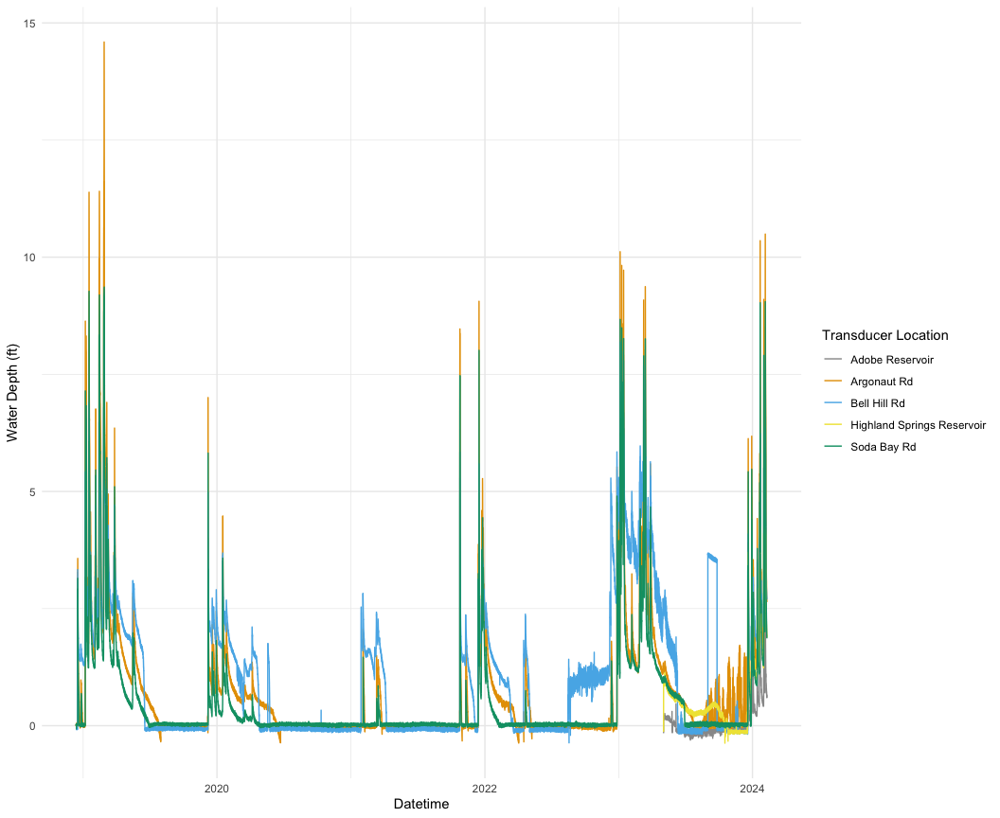

Update Trandsducer Data - v2
================
Maddee Rubenson (FlowWest)
2024-08-22

This script will add new transducer data to the legacy dataset to create
a new full dataset of all transducer data to date.

First read in the data:

``` r
source(here::here("analysis","surface_water", "qc_data.R"))
```

    ## Rows: 180847 Columns: 7
    ## ── Column specification ────────────────────────────────────────────────────────
    ## Delimiter: ","
    ## chr  (1): name
    ## dbl  (5): seconds, pressure_psi, depth_ft, barometric_pressure_psi, temperat...
    ## dttm (1): datetime
    ## 
    ## ℹ Use `spec()` to retrieve the full column specification for this data.
    ## ℹ Specify the column types or set `show_col_types = FALSE` to quiet this message.

    ## Rows: 180,847
    ## Columns: 7
    ## $ seconds                 <dbl> 0, 900, 1800, 2700, 3600, 4500, 5400, 6300, 72…
    ## $ pressure_psi            <dbl> 0.289, 0.291, 0.292, 0.291, 0.286, 0.291, 0.28…
    ## $ depth_ft                <dbl> 0.668, 0.671, 0.674, 0.671, 0.661, 0.672, 0.65…
    ## $ barometric_pressure_psi <dbl> 14.110, 14.110, 14.108, 14.108, 14.105, 14.104…
    ## $ datetime                <dttm> 2022-02-01 10:00:00, 2022-02-01 10:15:00, 202…
    ## $ name                    <chr> "Argonaut Rd", "Argonaut Rd", "Argonaut Rd", "…
    ## $ temperature_f           <dbl> 45.5468, 45.5468, 45.5468, 45.4532, 45.4532, 4…

    ## New names:
    ## Rows: 9591 Columns: 7
    ## ── Column specification
    ## ──────────────────────────────────────────────────────── Delimiter: "," chr
    ## (1): Date and Time dbl (5): Seconds, Pressure (PSI), Temperature (C), Depth
    ## (ft), Barometric Pr... lgl (1): ...7
    ## ℹ Use `spec()` to retrieve the full column specification for this data. ℹ
    ## Specify the column types or set `show_col_types = FALSE` to quiet this message.
    ## • `` -> `...7`

    ## Rows: 9,591
    ## Columns: 7
    ## $ seconds                 <dbl> 0, 900, 1800, 2700, 3600, 4500, 5400, 6300, 72…
    ## $ pressure_psi            <dbl> 0.142, 0.130, 0.123, 0.113, 0.096, 0.097, 0.07…
    ## $ depth_ft                <dbl> 0.328, 0.301, 0.284, 0.261, 0.222, 0.223, 0.17…
    ## $ barometric_pressure_psi <dbl> 14.114, 14.114, 14.108, 14.108, 14.112, 14.099…
    ## $ datetime                <dttm> 2023-11-01 13:00:00, 2023-11-01 13:15:00, 202…
    ## $ name                    <chr> "Argonaut Rd", "Argonaut Rd", "Argonaut Rd", "…
    ## $ temperature_f           <dbl> 48.6554, 48.9362, 49.0298, 49.1234, 49.4042, 4…

    ## Rows: 180843 Columns: 7
    ## ── Column specification ────────────────────────────────────────────────────────
    ## Delimiter: ","
    ## chr  (1): name
    ## dbl  (5): seconds, pressure_psi, depth_ft, barometric_pressure_psi, temperat...
    ## dttm (1): datetime
    ## 
    ## ℹ Use `spec()` to retrieve the full column specification for this data.
    ## ℹ Specify the column types or set `show_col_types = FALSE` to quiet this message.

    ## Rows: 180,843
    ## Columns: 7
    ## $ seconds                 <dbl> 0, 900, 1800, 2700, 3600, 4500, 5400, 6300, 72…
    ## $ pressure_psi            <dbl> -0.064, -0.068, -0.055, -0.056, -0.054, -0.059…
    ## $ depth_ft                <dbl> -0.148, -0.157, -0.128, -0.129, -0.124, -0.136…
    ## $ barometric_pressure_psi <dbl> 14.079, 14.082, 14.071, 14.072, 14.068, 14.075…
    ## $ datetime                <dttm> 2023-07-13 10:45:00, 2023-07-13 11:00:00, 202…
    ## $ name                    <chr> "Bell Hill Rd", "Bell Hill Rd", "Bell Hill Rd"…
    ## $ temperature_f           <dbl> 81.6890, 82.2110, 82.9058, 83.6870, 84.2918, 8…

    ## New names:
    ## Rows: 9591 Columns: 7
    ## ── Column specification
    ## ──────────────────────────────────────────────────────── Delimiter: "," chr
    ## (1): Date and Time dbl (5): Seconds, Pressure (PSI), Temperature (C), Depth
    ## (ft), Barometric Pr... lgl (1): ...7
    ## ℹ Use `spec()` to retrieve the full column specification for this data. ℹ
    ## Specify the column types or set `show_col_types = FALSE` to quiet this message.
    ## • `` -> `...7`

    ## Rows: 9,591
    ## Columns: 7
    ## $ seconds                 <dbl> 0, 900, 1800, 2700, 3600, 4500, 5400, 6300, 72…
    ## $ pressure_psi            <dbl> -0.051, -0.050, -0.049, -0.054, -0.056, -0.046…
    ## $ depth_ft                <dbl> -0.119, -0.116, -0.113, -0.126, -0.128, -0.106…
    ## $ barometric_pressure_psi <dbl> 14.114, 14.114, 14.108, 14.108, 14.112, 14.099…
    ## $ datetime                <dttm> 2023-11-01 13:00:00, 2023-11-01 13:15:00, 202…
    ## $ name                    <chr> "Bell Hill Rd", "Bell Hill Rd", "Bell Hill Rd"…
    ## $ temperature_f           <dbl> 74.9408, 74.8526, 75.8228, 76.8794, 78.0206, 7…

    ## Rows: 180847 Columns: 7
    ## ── Column specification ────────────────────────────────────────────────────────
    ## Delimiter: ","
    ## chr  (1): name
    ## dbl  (5): seconds, pressure_psi, depth_ft, barometric_pressure_psi, temperat...
    ## dttm (1): datetime
    ## 
    ## ℹ Use `spec()` to retrieve the full column specification for this data.
    ## ℹ Specify the column types or set `show_col_types = FALSE` to quiet this message.

    ## Rows: 180,847
    ## Columns: 7
    ## $ seconds                 <dbl> 0, 900, 1800, 2700, 3600, 4500, 5400, 6300, 72…
    ## $ pressure_psi            <dbl> 0.004, 0.010, 0.005, 0.014, 0.007, 0.007, 0.00…
    ## $ depth_ft                <dbl> 0.009, 0.024, 0.010, 0.033, 0.017, 0.016, 0.00…
    ## $ barometric_pressure_psi <dbl> 14.045, 14.041, 14.048, 14.037, 14.047, 14.045…
    ## $ datetime                <dttm> 2022-05-01 10:00:00, 2022-05-01 10:15:00, 202…
    ## $ name                    <chr> "Soda Bay Rd", "Soda Bay Rd", "Soda Bay Rd", "…
    ## $ temperature_f           <dbl> 49.6670, 49.9478, 50.7866, 51.3446, 51.9044, 5…

    ## New names:
    ## Rows: 9591 Columns: 7
    ## ── Column specification
    ## ──────────────────────────────────────────────────────── Delimiter: "," chr
    ## (1): Date and Time dbl (5): Seconds, Pressure (PSI), Temperature (C), Depth
    ## (ft), Barometric Pr... lgl (1): ...7
    ## ℹ Use `spec()` to retrieve the full column specification for this data. ℹ
    ## Specify the column types or set `show_col_types = FALSE` to quiet this message.
    ## • `` -> `...7`

    ## Rows: 9,591
    ## Columns: 7
    ## $ seconds                 <dbl> 0, 900, 1800, 2700, 3600, 4500, 5400, 6300, 72…
    ## $ pressure_psi            <dbl> 0.005, 0.004, 0.008, 0.003, -0.002, 0.008, -0.…
    ## $ depth_ft                <dbl> 0.013, 0.010, 0.018, 0.008, -0.004, 0.018, -0.…
    ## $ barometric_pressure_psi <dbl> 14.114, 14.114, 14.108, 14.108, 14.112, 14.099…
    ## $ datetime                <dttm> 2023-11-01 13:00:00, 2023-11-01 13:15:00, 202…
    ## $ name                    <chr> "Soda Bay Rd", "Soda Bay Rd", "Soda Bay Rd", "…
    ## $ temperature_f           <dbl> 52.2752, 52.4606, 52.5542, 52.6460, 52.8314, 5…
    ## Rows: 0
    ## Columns: 0

    ## New names:
    ## Rows: 9591 Columns: 7
    ## ── Column specification
    ## ──────────────────────────────────────────────────────── Delimiter: "," chr
    ## (1): Date and Time dbl (5): Seconds, Pressure (PSI), Temperature (F), Depth
    ## (ft), Barometric Pr... lgl (1): ...7
    ## ℹ Use `spec()` to retrieve the full column specification for this data. ℹ
    ## Specify the column types or set `show_col_types = FALSE` to quiet this message.
    ## • `` -> `...7`

    ## Rows: 9,591
    ## Columns: 7
    ## $ seconds                 <dbl> 0, 900, 1800, 2700, 3600, 4500, 5400, 6300, 72…
    ## $ pressure_psi            <dbl> -0.031, -0.035, -0.026, -0.031, -0.039, -0.028…
    ## $ temperature_f           <dbl> 89.568, 91.615, 94.247, 96.442, 98.292, 99.046…
    ## $ depth_ft                <dbl> -0.072, -0.082, -0.060, -0.073, -0.091, -0.065…
    ## $ barometric_pressure_psi <dbl> 14.114, 14.114, 14.108, 14.108, 14.112, 14.099…
    ## $ datetime                <dttm> 2023-11-01 13:00:00, 2023-11-01 13:15:00, 202…
    ## $ name                    <chr> "Adobe Reservoir", "Adobe Reservoir", "Adobe R…

    ## Rows: 27063 Columns: 7
    ## ── Column specification ────────────────────────────────────────────────────────
    ## Delimiter: ","
    ## chr  (1): name
    ## dbl  (5): seconds, pressure_psi, temperature_f, depth_ft, barometric_pressur...
    ## dttm (1): datetime
    ## 
    ## ℹ Use `spec()` to retrieve the full column specification for this data.
    ## ℹ Specify the column types or set `show_col_types = FALSE` to quiet this message.

    ## Rows: 27,063
    ## Columns: 7
    ## $ seconds                 <dbl> 0.000, 900.001, 1800.001, 2700.001, 3600.001, …
    ## $ pressure_psi            <dbl> -0.057, -0.056, 0.428, 0.429, 0.412, 0.413, 0.…
    ## $ temperature_f           <dbl> 61.333, 62.786, 60.969, 60.605, 60.240, 60.605…
    ## $ depth_ft                <dbl> -0.132, -0.129, 0.989, 0.990, 0.951, 0.953, 0.…
    ## $ barometric_pressure_psi <dbl> 13.975, 13.974, 13.975, 13.967, 13.971, 13.977…
    ## $ datetime                <dttm> 2023-05-03 12:00:00, 2023-05-03 12:15:00, 202…
    ## $ name                    <chr> "Highland Springs Reservoir", "Highland Spring…

    ## New names:
    ## Rows: 9591 Columns: 7
    ## ── Column specification
    ## ──────────────────────────────────────────────────────── Delimiter: "," chr
    ## (1): Date and Time dbl (5): Seconds, Pressure (PSI), Temperature (F), Depth
    ## (ft), Barometric Pr... lgl (1): ...7
    ## ℹ Use `spec()` to retrieve the full column specification for this data. ℹ
    ## Specify the column types or set `show_col_types = FALSE` to quiet this message.
    ## • `` -> `...7`

    ## Rows: 9,591
    ## Columns: 7
    ## $ seconds                 <dbl> 0, 900, 1800, 2700, 3600, 4500, 5400, 6300, 72…
    ## $ pressure_psi            <dbl> -0.055, -0.064, -0.061, -0.062, -0.068, -0.063…
    ## $ temperature_f           <dbl> 49.788, 49.975, 50.257, 50.444, 50.631, 50.631…
    ## $ depth_ft                <dbl> -0.128, -0.148, -0.141, -0.144, -0.156, -0.145…
    ## $ barometric_pressure_psi <dbl> 14.114, 14.114, 14.108, 14.108, 14.112, 14.099…
    ## $ datetime                <dttm> 2023-11-01 13:00:00, 2023-11-01 13:15:00, 202…
    ## $ name                    <chr> "Highland Springs Reservoir", "Highland Spring…

Combine the newly updated files:

``` r
all_updated <- bind_rows(argonaut_updated, bellhill_updated, sodabay_updated, adobe_updated, highland_updated) |> 
  glimpse()
```

    ## Rows: 579,187
    ## Columns: 7
    ## $ seconds                 <dbl> 0, 900, 1800, 2700, 3600, 4500, 5400, 6300, 72…
    ## $ pressure_psi            <dbl> 0.289, 0.291, 0.292, 0.291, 0.286, 0.291, 0.28…
    ## $ depth_ft                <dbl> 0.668, 0.671, 0.674, 0.671, 0.661, 0.672, 0.65…
    ## $ barometric_pressure_psi <dbl> 14.110, 14.110, 14.108, 14.108, 14.105, 14.104…
    ## $ datetime                <dttm> 2022-02-01 10:00:00, 2022-02-01 10:15:00, 202…
    ## $ name                    <chr> "Argonaut Rd", "Argonaut Rd", "Argonaut Rd", "…
    ## $ temperature_f           <dbl> 45.5468, 45.5468, 45.5468, 45.4532, 45.4532, 4…

Next, visualize the data to make sure everything appended and updated
correctly. All three transducers should have a record from 12/13/2018 to
the date of the most recent data download.

``` r
# TODO: check to make sure this is right - assuming the transducers are soda bay, argonaut, bell hill
all_updated |> 
  group_by(name) |>
  summarise(min_date = min(datetime),
            max_date = max(datetime),
            n = n()) |> 
  knitr::kable()
```

| name                       | min_date            | max_date            |      n |
|:---------------------------|:--------------------|:--------------------|-------:|
| Adobe Reservoir            | 2023-11-01 13:00:00 | 2024-02-09 09:30:00 |   9587 |
| Argonaut Rd                | 2018-12-13 09:00:00 | 2024-02-09 09:30:00 | 180847 |
| Bell Hill Rd               | 2018-12-13 09:00:00 | 2024-02-09 09:30:00 | 180843 |
| Highland Springs Reservoir | 2023-05-03 12:00:00 | 2024-02-09 09:30:00 |  27063 |
| Soda Bay Rd                | 2018-12-13 09:00:00 | 2024-02-09 09:30:00 | 180847 |

``` r
ggplot(data = all_updated, aes(x = datetime, y = depth_ft, color = name)) +     
  geom_line() + 
  labs(color = "Transducer Location", x = "Datetime", y = "Water Depth (ft)") +
  theme_minimal()
```

<!-- -->

Once you’ve confirmed the data has been correctly updated, copy the old
files into the `backup` folder to ensure we aren’t writing over
anything. The old data will be copied over with a timestamp of the
current day.

``` r
all_existing_files <- list.files(here::here("data", "surface_water"))

backup_folder <- "backup"
# Create the backup folder if it doesn't exist
if (!dir.exists(backup_folder)) {
  dir.create(here::here("data", "surface_water", backup_folder))
}

# Loop through each file and create a backup
for (file in all_existing_files) {
  
  base_filename <- sub("\\.csv$", "", file)
  
  # Copy the original file to the backup folder
  file.copy(from = here::here("data", "surface_water", paste0(base_filename, "-", Sys.Date(), ".csv")), 
            to = here::here("data", "surface_water", "backup"))
}

# Check the backup folder to ensure files are copied
list.files(here::here("data", "surface_water", backup_folder))
```

    ## [1] "adobe_res_20240213.csv"                 
    ## [2] "adobe_transducers_combined_20240213.csv"
    ## [3] "argonaut_20240213.csv"                  
    ## [4] "bellhill_20240213.csv"                  
    ## [5] "highlandsprings_res_20240213.csv"       
    ## [6] "sodabay_20240213.csv"

Save new files

``` r
write_csv(argonaut_updated, here::here("data", "surface_water", paste0('argonaut_updated', ".csv")))
write_csv(bellhill_updated, here::here("data", "surface_water", paste0('bellhill_updated', ".csv")))
write_csv(sodabay_updated, here::here("data", "surface_water", paste0('sodabay_updated', ".csv")))
write_csv(adobe_updated, here::here("data", "surface_water", paste0('adobe_updated', ".csv")))
write_csv(highland_updated, here::here("data", "surface_water", paste0('highland_updated', ".csv")))
```
