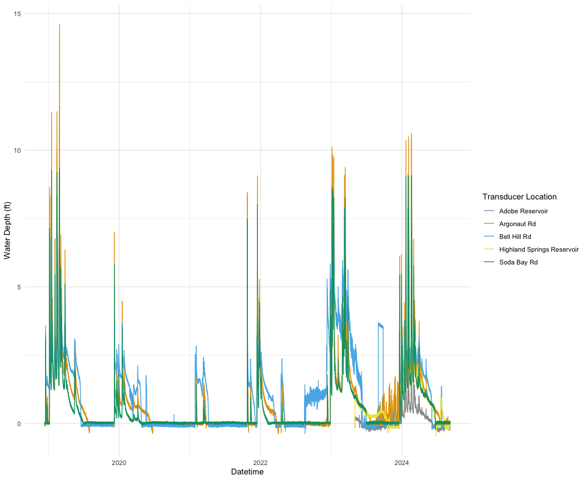

Update Trandsducer Data - v2
================
Maddee Wiggins (FlowWest)
2024-10-29

## Source Data

This script will compile all transducer data that is located in the
`data-raw/surface_water/compensated_data` folder

First, source script:

TODO: note that `seconds` column is not reading in correctly. Check to
make sure this is okay.

``` r
source(here::here("analysis","surface_water", "run_all_files.R"))
```

    ## Rows: 697,488
    ## Columns: 8
    ## $ seconds                 <dbl> 0, 900, 1800, 2700, 3600, 4500, 5400, 6300, 72…
    ## $ pressure_psi            <dbl> -0.031, -0.035, -0.026, -0.031, -0.039, -0.028…
    ## $ temperature_f           <dbl> 89.568, 91.615, 94.247, 96.442, 98.292, 99.046…
    ## $ depth_ft                <dbl> -0.072, -0.082, -0.060, -0.073, -0.091, -0.065…
    ## $ barometric_pressure_psi <dbl> 14.114, 14.114, 14.108, 14.108, 14.112, 14.099…
    ## $ name                    <chr> "Adobe Reservoir", "Adobe Reservoir", "Adobe R…
    ## $ file_name               <chr> "Adobe Reservoir Outlet_Append_2024-09-06_12-3…
    ## $ datetime                <dttm> 2023-11-01 13:00:00, 2023-11-01 13:15:00, 202…

``` r
all_surface_water |> glimpse()
```

    ## Rows: 697,488
    ## Columns: 8
    ## $ seconds                 <dbl> 0, 900, 1800, 2700, 3600, 4500, 5400, 6300, 72…
    ## $ pressure_psi            <dbl> -0.031, -0.035, -0.026, -0.031, -0.039, -0.028…
    ## $ temperature_f           <dbl> 89.568, 91.615, 94.247, 96.442, 98.292, 99.046…
    ## $ depth_ft                <dbl> -0.072, -0.082, -0.060, -0.073, -0.091, -0.065…
    ## $ barometric_pressure_psi <dbl> 14.114, 14.114, 14.108, 14.108, 14.112, 14.099…
    ## $ name                    <chr> "Adobe Reservoir", "Adobe Reservoir", "Adobe R…
    ## $ file_name               <chr> "Adobe Reservoir Outlet_Append_2024-09-06_12-3…
    ## $ datetime                <dttm> 2023-11-01 13:00:00, 2023-11-01 13:15:00, 202…

## Visualize and Explore Data

Next, visualize the data to make sure everything appended and updated
correctly.

``` r
all_surface_water |> 
  group_by(name) |>
  summarise(min_date = min(datetime),
            max_date = max(datetime),
            n = n()) |> 
  knitr::kable()
```

| name                       | min_date            | max_date            |      n |
|:---------------------------|:--------------------|:--------------------|-------:|
| Adobe Reservoir            | 2023-05-03 12:00:00 | 2024-09-06 11:45:00 |  47228 |
| Argonaut Rd                | 2018-12-13 09:00:00 | 2024-09-06 11:45:00 | 201012 |
| Bell Hill Rd               | 2018-12-13 09:00:00 | 2024-09-06 11:45:00 | 201008 |
| Highland Springs Reservoir | 2023-05-03 12:00:00 | 2024-09-06 11:45:00 |  47228 |
| Soda Bay Rd                | 2018-12-13 09:00:00 | 2024-09-06 11:45:00 | 201012 |

### Water Depth

``` r
ggplot(data = all_surface_water, aes(x = datetime, y = depth_ft, color = name)) +     
  geom_line() + 
  scale_color_manual(values = palette) +
  labs(color = "Transducer Location", x = "Datetime", y = "Water Depth (ft)") +
  theme_minimal() 
```

<!-- -->

### Pressure

``` r
ggplot(data = all_surface_water, aes(x = datetime, y = pressure_psi, color = name)) +     
  geom_line() + 
  scale_color_manual(values = palette) +
  labs(color = "Transducer Location", x = "Datetime", y = "Pressure (psi)") +
  theme_minimal()
```

<!-- -->

### Temperature

``` r
ggplot(data = all_surface_water, aes(x = datetime, y = temperature_f, color = name)) +     
  geom_line() + 
  scale_color_manual(values = palette) +
  labs(color = "Transducer Location", x = "Datetime", y = "Temperature (f)") +
  theme_minimal()
```

<!-- -->

## Save aggregated data

Now save an Rdata file of aggregated surface water data in the
`data/surface_water` folder

``` r
all_surface_water |> saveRDS(here::here("data", "surface_water", "surface_water_data_aggregated.RDS"))
```
