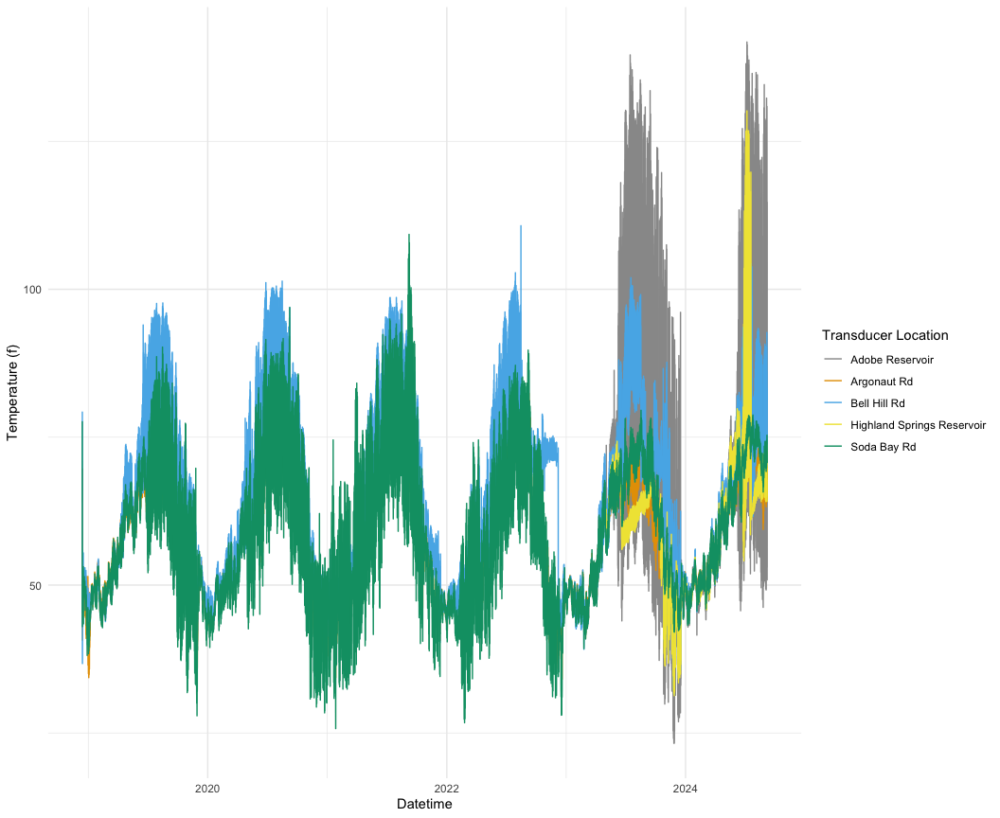
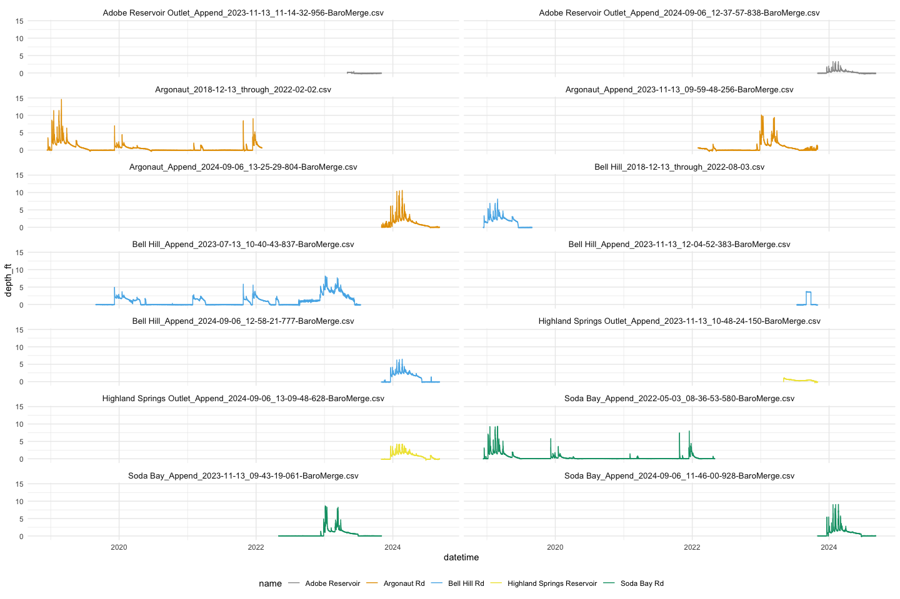

Update Trandsducer Data - v2
================
Maddee Wiggins (FlowWest)
2024-11-21

## Source Data

This script will compile all transducer data that is located in the
`data-raw/surface_water/compensated_data` folder

First, source script:

TODO: note that `seconds` column is not reading in correctly. Check to
make sure this is okay.

``` r
source(here::here("analysis","surface_water", "run_all_files.R"))
```

    ## Rows: 697,488
    ## Columns: 8
    ## $ seconds                 <dbl> 0, 900, 1800, 2700, 3600, 4500, 5400, 6300, 72…
    ## $ pressure_psi            <dbl> -0.031, -0.035, -0.026, -0.031, -0.039, -0.028…
    ## $ temperature_f           <dbl> 89.568, 91.615, 94.247, 96.442, 98.292, 99.046…
    ## $ depth_ft                <dbl> -0.072, -0.082, -0.060, -0.073, -0.091, -0.065…
    ## $ barometric_pressure_psi <dbl> 14.114, 14.114, 14.108, 14.108, 14.112, 14.099…
    ## $ name                    <chr> "Adobe Reservoir", "Adobe Reservoir", "Adobe R…
    ## $ file_name               <chr> "Adobe Reservoir Outlet_Append_2024-09-06_12-3…
    ## $ datetime                <dttm> 2023-11-01 13:00:00, 2023-11-01 13:15:00, 202…

``` r
all_surface_water |> glimpse()
```

    ## Rows: 697,488
    ## Columns: 8
    ## $ seconds                 <dbl> 0, 900, 1800, 2700, 3600, 4500, 5400, 6300, 72…
    ## $ pressure_psi            <dbl> -0.031, -0.035, -0.026, -0.031, -0.039, -0.028…
    ## $ temperature_f           <dbl> 89.568, 91.615, 94.247, 96.442, 98.292, 99.046…
    ## $ depth_ft                <dbl> -0.072, -0.082, -0.060, -0.073, -0.091, -0.065…
    ## $ barometric_pressure_psi <dbl> 14.114, 14.114, 14.108, 14.108, 14.112, 14.099…
    ## $ name                    <chr> "Adobe Reservoir", "Adobe Reservoir", "Adobe R…
    ## $ file_name               <chr> "Adobe Reservoir Outlet_Append_2024-09-06_12-3…
    ## $ datetime                <dttm> 2023-11-01 13:00:00, 2023-11-01 13:15:00, 202…

## Visualize and Explore Data

Next, visualize the data to make sure everything appended and updated
correctly.

``` r
all_surface_water |> 
  group_by(name) |>
  summarise(min_date = min(datetime),
            max_date = max(datetime),
            n = n()) |> 
  knitr::kable()
```

| name                       | min_date            | max_date            |      n |
|:---------------------------|:--------------------|:--------------------|-------:|
| Adobe Reservoir            | 2023-05-03 12:00:00 | 2024-09-06 11:45:00 |  47228 |
| Argonaut Rd                | 2018-12-13 09:00:00 | 2024-09-06 11:45:00 | 201012 |
| Bell Hill Rd               | 2018-12-13 09:00:00 | 2024-09-06 11:45:00 | 201008 |
| Highland Springs Reservoir | 2023-05-03 12:00:00 | 2024-09-06 11:45:00 |  47228 |
| Soda Bay Rd                | 2018-12-13 09:00:00 | 2024-09-06 11:45:00 | 201012 |

### Water Depth

``` r
ggplot(data = all_surface_water, aes(x = datetime, y = depth_ft, color = name)) +     
  geom_line() + 
  scale_color_manual(values = palette) +
  labs(color = "Transducer Location", x = "Datetime", y = "Water Depth (ft)") +
  theme_minimal() 
```

<!-- -->

### Pressure

``` r
ggplot(data = all_surface_water, aes(x = datetime, y = pressure_psi, color = name)) +     
  geom_line() + 
  scale_color_manual(values = palette) +
  labs(color = "Transducer Location", x = "Datetime", y = "Pressure (psi)") +
  theme_minimal()
```

<!-- -->

### Temperature

``` r
ggplot(data = all_surface_water, aes(x = datetime, y = temperature_f, color = name)) +     
  geom_line() + 
  scale_color_manual(values = palette) +
  labs(color = "Transducer Location", x = "Datetime", y = "Temperature (f)") +
  theme_minimal()
```

<!-- -->

## By file type

``` r
ggplot(all_surface_water, aes(datetime, y = depth_ft)) +
  geom_line(aes(color = name)) +
  scale_color_manual(values = palette) +
  theme_minimal() +
  facet_wrap(~file_name, ncol = 2) + 
  theme(strip.text = element_text(size = 10),
        legend.position = "bottom")
```

<!-- -->

``` r
# function
flag_datum_shift <- function(data, threshold = 1.0) {
  data |> 
    group_by(name) |> 
    arrange(datetime) |> 
    mutate(
      diff = c(NA, diff(depth_ft)),  
      flagged = ifelse(abs(diff) > threshold, TRUE, FALSE)  
    )
}


threshold <- 0.5  # Adjust threshold for your data
flagged_data <- flag_datum_shift(all_surface_water, threshold)


ggplot(flagged_data, aes(x = datetime, y = depth_ft)) +
  geom_line() +
  geom_point(data = flagged_data %>% filter(flagged), 
             aes(x = datetime, y = depth_ft), 
             color = "red", size = 3, shape = 8) +
  labs(x = "Time",
       y = "Depth (ft)",
       title = "Datum Shift Detection",
       subtitle = paste("Threshold for datum shift =", threshold, "ft")) +
  theme_minimal() +
  facet_wrap(~name)
```

<!-- -->

``` r
flagged_data |>  
  filter(flagged) |> 
  select(name, datetime, depth_ft, diff, file_name)
```

    ## # A tibble: 150 × 5
    ## # Groups:   name [4]
    ##    name         datetime            depth_ft  diff file_name                    
    ##    <chr>        <dttm>                 <dbl> <dbl> <chr>                        
    ##  1 Bell Hill Rd 2018-12-16 14:15:00    0.868 0.934 Bell Hill_2018-12-13_through…
    ##  2 Argonaut Rd  2018-12-17 01:00:00    0.988 0.981 Argonaut_2018-12-13_through_…
    ##  3 Argonaut Rd  2018-12-17 01:15:00    2.71  1.72  Argonaut_2018-12-13_through_…
    ##  4 Soda Bay Rd  2018-12-17 03:15:00    1.41  1.40  Soda Bay_Append_2022-05-03_0…
    ##  5 Soda Bay Rd  2018-12-17 03:30:00    2.74  1.33  Soda Bay_Append_2022-05-03_0…
    ##  6 Soda Bay Rd  2019-01-06 15:45:00    1.13  1.11  Soda Bay_Append_2022-05-03_0…
    ##  7 Argonaut Rd  2019-01-06 16:15:00    3.61  0.549 Argonaut_2018-12-13_through_…
    ##  8 Soda Bay Rd  2019-01-06 17:00:00    2.83  0.529 Soda Bay_Append_2022-05-03_0…
    ##  9 Soda Bay Rd  2019-01-06 17:15:00    3.37  0.54  Soda Bay_Append_2022-05-03_0…
    ## 10 Argonaut Rd  2019-01-09 04:00:00    4.24  0.536 Argonaut_2018-12-13_through_…
    ## # ℹ 140 more rows

## Save aggregated data

Now save an Rdata file of aggregated surface water data in the
`data/surface_water` folder

``` r
all_surface_water |> saveRDS(here::here("data", "surface_water", "surface_water_data_aggregated.RDS"))
```
